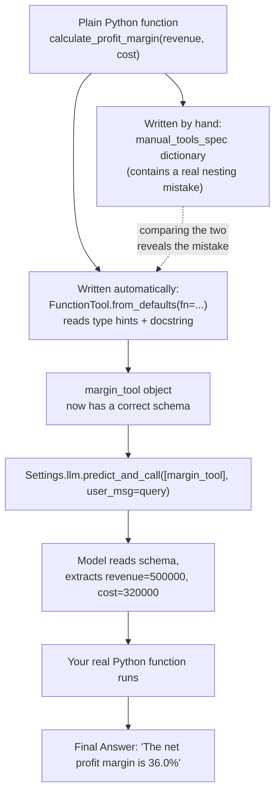

# Day 1 was about Teaching a Computer to "See" a Function

## What problem was I solving today?

Imagine you have a friend who is incredibly smart but has never seen your calculator. If you want your friend to use the calculator correctly, you can't just hand it over — you need to explain what each button does, in words your friend can understand, before they'll ever press the right one.

An AI language model is exactly like that friend. It cannot look inside your Python code and understand what a function does. All it can ever see is a **description** of that function — its name, what it does, and what information it needs. That description is called a **JSON schema**, and Day 1's whole job was to understand exactly what that description looks like, by writing one yourself, by hand, before letting a library write it for you automatically.

## What did I actually type, and what does it mean?

**Cell 0 — Getting ready**
```python
import os
import json
from dotenv import load_dotenv
from llama_index.llms.groq import Groq
from llama_index.core.tools import FunctionTool
from llama_index.core import Settings

load_dotenv()
groq_api_key = os.getenv('GROQ_API_KEY')
print('Environment ready...!')
```
`load_dotenv()` reads a hidden file on your computer called `.env`, where you keep secret passwords (called API keys) so they never appear directly in your code where someone could steal them by looking at your screen or your GitHub page. `os.getenv('GROQ_API_KEY')` then pulls that specific secret out and stores it in a variable so the rest of the notebook can use it. Think of it like keeping your house key in a hidden spot instead of taping it to your front door.

**Cell 1 — Saying hello to the AI model**
```python
Settings.llm = Groq(
    model= 'llama-3.3-70B-versatile',
    api_key= groq_api_key
)
response = Settings.llm.complete('Hello, can you hear me?')
print(f"LLM Status: {response}")
```
`Settings.llm = Groq(...)` is a special LlamaIndex pattern. Instead of creating a model and having to pass it around to every single function in your notebook, you set it once as a **global setting** — like setting your phone's default ringtone once instead of choosing it every time someone calls. From here on, any LlamaIndex tool that needs an AI model will automatically reach for this one. `.complete('Hello, can you hear me?')` just sends a plain question and prints the plain answer back, to prove the connection actually works before you build anything more complicated on top of it. Your output showed the model replying, "I can understand and respond to your text. How can I assist you today?" — so the connection was confirmed working.

**Cell 2 — The actual worker function**
```python
def calculate_profit_margin(revenue: float, cost: float) -> str:
    '''it calculates the net profit margin percentage based on revenue and cost.'''
    if revenue <= 0:
        return 'Error: Revenue must be greater than 0.'
    profit = revenue - cost
    margin = (profit / revenue) * 100
    return f"The net profit margin is {round(margin, 2)}%"
```
This is just ordinary Python — nothing about it knows it will ever be shown to an AI model. It takes two numbers, `revenue` and `cost`, checks that revenue isn't zero or negative (because dividing by zero would crash the program — this is called a **guard clause**, a small safety check placed right at the top of a function), then works out the profit margin as a percentage and returns it as a sentence. The three little quote marks `'''...'''` right under the function's first line are called a **docstring** — a description of what the function does, written for humans to read. You'll see in a moment that this docstring turns out to matter enormously.

**Cell 3 — Writing the description by hand**
```python
manual_tools_spec = {
    "name": "calculate_profit_margin",
    "description": "Calculate the net profit margin percentage based on revenue and cost.",
    "parameters": {
        "type": "object",
        "properties": {
            "revenue": "number",
            "description": "The total gross revenue earned."
        },
        "cost": {
            "type": "number",
            "description": "The total expenses/costs incurred."
        },
        "required": ["revenue", "cost"]
    }
}
```
This is a Python dictionary — a structure of labelled boxes inside labelled boxes — written to describe the function above in a format the AI can read. Here's the part worth slowing down on: **this schema, written by hand, actually has a small mistake in it.** Look closely at how `"revenue"` and `"cost"` are described. `"cost"` is written correctly — it's its own little box with a `"type"` and a `"description"` inside it. But `"revenue"` is just given the bare word `"number"`, and the `"description"` that was meant for `revenue` ended up as a *sibling* of `revenue` instead of being nested inside it. In proper JSON Schema, every parameter needs to look like `cost` does — its own object with its own `type` and `description` inside. This is an extremely easy mistake to make by hand, and it's exactly the kind of mistake Day 1 exists to help you notice.

**Cell 4 — Letting the library do it automatically**
```python
margin_tool = FunctionTool.from_defaults(fn = calculate_profit_margin)
auto_spec = margin_tool.metadata.get_parameters_dict()
print("Auto-Generated Schema:")
print(json.dumps(auto_spec, indent = 2))
```
`FunctionTool.from_defaults(fn=calculate_profit_margin)` hands your plain Python function to LlamaIndex and asks it to build the schema *for* you. It does this by reading two things: the **type hints** in the function signature (`revenue: float, cost: float`) and the **docstring** you wrote. The result, printed out, was:
```json
{
  "properties": {
    "revenue": {"title": "Revenue", "type": "number"},
    "cost": {"title": "Cost", "type": "number"}
  },
  "required": ["revenue", "cost"],
  "type": "object"
}
```
Notice both `revenue` and `cost` are correctly nested objects here — the library didn't make the mistake you made by hand. This is the entire lesson of Day 1 in one comparison: writing schemas by hand is genuinely easy to get subtly wrong, and that's exactly why tools like `FunctionTool.from_defaults` exist — not because you're incapable of writing one, but because a computer never gets tired or distracted halfway through nesting a dictionary.

**Cell 5 — The moment of truth**
```python
query = "My company made $500,000 in revenue last year with $320,000 in costs. What was our profit margin?"
response = Settings.llm.predict_and_call(
    [margin_tool],
    user_msg = query
)
print(f"Final Answer: {response}")
```
`predict_and_call` does three things in one line: it shows the AI model your tool's schema, lets the model decide the numbers to use ($500,000 and $320,000), actually runs your Python function with those numbers, and returns the final sentence. Your output was: **"The net profit margin is 36.0%"** — and if you check the math by hand, ($500,000 − $320,000) ÷ $500,000 × 100 = 36.0%, so the model extracted the right numbers from a sentence and called your function correctly.

## The flow of Day 1



## What this taught me for every day after this one

Every single day from here to Day 25 involves handing an AI model one or more tools. Every one of those tools has a schema behind it, whether you see it or not. Day 1 is the only day where you deliberately slowed down and looked at that schema with your own eyes — which means for the rest of this journey, you can trust that the schema is correct without needing to check it by hand again, because you now know exactly what "correct" looks like.
