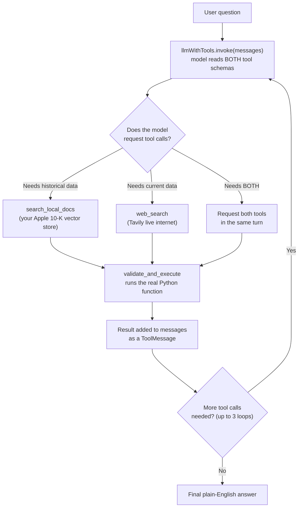

# Day 2 Giving the AI a Choice Between Two Different Brains

## What problem was I solving today?

On Day 1, you had exactly one tool. But real questions are rarely that simple. Imagine asking a librarian "What does this old book say about Apple's finances, and what is Apple's stock doing today?"  a good librarian knows the old book can't possibly answer the second half, and would need to check today's newspaper too. Day 2 was about building an AI "librarian" that could tell the difference between a question that needs your own saved documents and a question that needs the live internet and could even use both at once when a question needed it.

## What did I actually type, and what does it mean?

**Cell 1 — Reconnecting to Month 1's memory**
```python
mongoClient = MongoClient(os.getenv('MONGO_URI'))
asyncMongoClient = AsyncMongoClient(os.getenv('MONGO_URI'))

docstore = MongoDocumentStore.from_uri(
    uri = os.getenv('MONGO_URI'),
    db_name = 'month1_database',
    namespace = 'month_1_collection'
)

vectorStore = MongoDBAtlasVectorSearch(
    mongodb_client=mongoClient,
    async_mongodb_client= asyncMongoClient,
    db_name= 'month1_database',
    collection_name= 'month_1_rag_collection_v3',
    vector_index_name= 'final_index_v3',
    embedding_key= 'embedding'
)

storageContext = StorageContext.from_defaults(vector_store= vectorStore, docstore= docstore)
index = VectorStoreIndex.from_vector_store(vector_store= vectorStore, storage_context = storageContext)
```
Here's an important word to understand: **reconnecting**, not rebuilding. Back in Month 1, you spent real time and real money turning the Apple 10-K document into thousands of tiny numeric fingerprints (called embeddings) and storing them in a cloud database called MongoDB Atlas. Every single day from here to the end of Month 2, instead of doing that expensive work again, you just reach back into that same storage and reconnect to it the same way you don't rebuild your house every morning, you just unlock the door you already have. `VectorStoreIndex.from_vector_store(...)` is the "unlock the door" method, as opposed to `VectorStoreIndex.from_documents(...)` which would be "build the house from scratch."

**Cell 2 Your first tool: searching your own documents**
```python
@tool
def search_local_docs(query:str) -> str:
    """Searches my local Knowledge base containing historical Apple 10-K financial documents
    (covering fiscal years up to 2024)...
    CRITICAL: Do not pass comparative or converstional questions here.
    Convert queries into strict financial line items..."""
    retriever = index.as_retriever(similarity_top_k = 4)
    results = retriever.retrieve(query)
    return "\n\n".join([doc.node.get_content() for doc in results])
```
`index.as_retriever(similarity_top_k = 4)` turns your document index into a search engine that returns the 4 most similar chunks of text to whatever question comes in. The `@tool` decorator sitting on top of the function is what wraps it up as something an AI model can be shown, similar to `FunctionTool.from_defaults` from Day 1 but from a different library (LangChain, which you'll be using for the rest of this journey). Look closely at the docstring: it doesn't just say what the tool does, it gives the model an explicit instruction  "Convert queries into strict financial line items." That's not decoration. The model reads this exact text before deciding how to phrase its search, so the more precisely you write it, the better your search results will be.

**Cell 3 Your second tool: searching the live internet**
```python
web_search = TavilySearchResults(max_results = 3)
web_search.name = "web_search"
```
Tavily is a search service built specifically for AI agents. `max_results = 3` means it will hand back the top 3 web pages it finds. Giving it the name `"web_search"` explicitly (line 2) matters because that name is what shows up in the tool's schema, and it's what the model will use later when it decides which tool to call.

**Cell 4 Assembling the two-tool agent**
```python
tools = [search_local_docs, web_search]
toolMap = {t.name: t for t in tools}
llmWithTools = llm.bind_tools(tools= tools)
```
`.bind_tools(tools=tools)` is the LangChain equivalent of Day 1's `predict_and_call`, but it's a two-step process instead of one, this line only *attaches* the tools' schemas to the model; you still have to write the loop that actually reads the model's decision and executes the right function (you did this back on Day 6, and you're reusing it below). `toolMap = {t.name: t for t in tools}` builds a lookup dictionary, a quick way to go from "the model said it wants 'web_search'" to "here is the actual Python function called `web_search`."

**Cell 5 Reusing Day 6's safety net**
```python
def validate_and_execute(tool_call: dict) -> str:
    toolName = tool_call['name']
    if toolName not in toolMap:
        error_msg = (f"SYSTEM ERROR: You attempted to call a tool named '{toolName}', "
            f"but it does not exist...")
        return error_msg
    try:
        return toolMap[toolName].invoke(tool_call['args'])
    except Exception as e:
        error_msg = f"SYSTEM ERROR executing '{toolName}': {str(e)}..."
        return error_msg
```
This exact function was written on Day 6 (documented later in this book) and is reused here first, chronologically, before its own dedicated day. Its job is simple but important: before ever running a tool the AI model asked for, check that the tool actually exists. If it doesn't, instead of the whole program crashing with a Python error, it hands back a plain-English error message the model can read and try again from.

**Cell 4 (loop) The actual back-and-forth conversation**
```python
def run_research_agent(query: str, max_retries: int = 3):
    messages = [SystemMessage(content=(
        "You are a precise dual-retrieval research assistant.\n"
        "1. If a query asks to compare historical data with recent, current, or 'last year' figures, "
        "you MUST use both tools...\n"
        "2. The local documents contain historical Apple inc. financial records...")),
        HumanMessage(content=query)]

    response = llmWithTools.invoke(messages)
    messages.append(response)

    attempts = 0
    while response.tool_calls and attempts < max_retries:
        attempts += 1
        for tool_call in response.tool_calls:
            result = validate_and_execute(tool_call= tool_call)
            messages.append(ToolMessage(content=str(result), tool_call_id = tool_call['id']))
        response = llmWithTools.invoke(messages)
        messages.append(response)

    return response.content
```
This is the heart of Day 2. Think of `messages` as a growing transcript of a conversation. First you tell the model the rules (`SystemMessage`) and ask your question (`HumanMessage`). The model replies, and if that reply includes `tool_calls` (meaning "I want to use a tool"), the `while` loop kicks in: it runs every requested tool, adds the results back into the transcript as `ToolMessage`s, and asks the model again now with the tool results available to read. This keeps happening, up to 3 times, until the model finally answers in plain text with no more tool requests left.

## What actually happened when I ran it

Two test questions were asked. The first was purely a web question: *"What is today's date and are there any major apple company news this week?"*  the agent chose `web_search` on the very first try and answered correctly with real current information.

The second question was the real test: *"Compare the sales in my vector store by year to the apple sales published last year."* This needed **both** tools, and here's exactly what happened:
```
--- Loop iteration 1 ---
Agent chose: search_local_docs
Agent chose: web_search
--- Loop iteration 2 ---
Agent chose: search_local_docs
Agent chose: web_search

Final Agent Response:
The sales in your vector store by year are as follows:
* 2024: $391,035 million
* 2023: $383,285 million
* 2022: $394,328 million
The Apple sales published last year were:
* 2023: $383 billion
```
The model called both tools, not just once but across two full loop iterations, before it felt confident enough to answer and the final answer correctly combined numbers from your own stored documents with a number it found on the live web. This is proof the routing logic actually worked, not just in theory but in a real, observed run.

## The flow of Day 2



## Why this mattered for later days

This is the first day your system had to make a genuine decision rather than just following one fixed path. Every day from here forward — the router on Day 12, the classify_node in your LangGraph pipeline from Day 14 onward — is a more sophisticated version of exactly this same idea: look at the question, decide which capability actually answers it, and don't waste effort using the wrong one.
