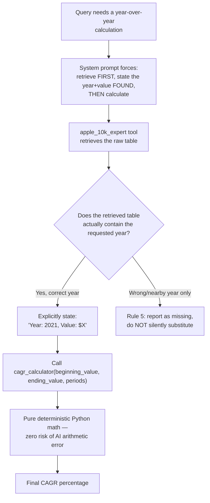

# Day 3. Never Let the AI Do Math in Its Head

## What problem was I solving today?

If you ask a friend to add up a long column of numbers purely from memory, without writing anything down, they'll sometimes get it slightly wrong, not because they're careless, but because holding many numbers in your head at once is genuinely hard for anyone, including AI models. Day 3 was about making sure your system never trusts an AI model to do arithmetic by itself. Instead, every calculation gets handed off to real, deterministic Python math, the same kind of calculator logic that never makes a mistake, ever, no matter how many times you run it.

## What did I actually type, and what does it mean?

**Cell 2. Three small, focused calculator tools**
```python
def calculate_cagr(beginning_value: float, ending_value: float, periods: int) -> float:
    """Calculates the Compound Annual Growth Rate (CAGR)."""
    if beginning_value <= 0 or periods <= 0:
        return 0.0
    cagr = (ending_value / beginning_value) ** (1 / periods) - 1
    return round(cagr * 100, 2)
```
CAGR tells you how fast something grew per year, averaged out, if it had grown at a perfectly steady rate. Notice the guard clause again  `if beginning_value <= 0 or periods <= 0: return 0.0`  protecting against impossible math the same way Day 1's function protected against dividing by zero. This pattern (check for bad input first, then do the real work) shows up in nearly every tool you'll ever write.

Two similar tools were built alongside it, one for net profit margin, one for year-over-year growth, each wrapped explicitly with `FunctionTool.from_defaults(fn=..., name=..., description=...)`, this time passing `name` and `description` by hand instead of letting the library guess them. This is worth noticing as a small but deliberate choice: with five tools now sharing one agent (the document search tool, three calculators, and the web search tool), being extra explicit about names reduces any chance of the model confusing similarly-shaped tools.

**Cell 4. The system prompt that does the real work**
```python
systemPrompt = """
You are a Senior Apple Financial Analyst. Your goal is to provide accurate financial insights.
1. Use 'apple_10k_expert' to find specific dollar amounts from the reports.
2. For ANY calculation (growth, margins, CAGR), you MUST use the appropriate calculator tool.
3. Never calculate percentages or multi-year growth manualy in your head.
4. If a number is in millions (e.g., $383,285), ensure you use the full numeric value for the calculators.
5. If the user asks for specific years (e.g., 2021 and 2023), do not substitute them with intermediate years like 2022...
6. Before calling a calculator tool, you MUST explicitly state the Year and Value you found...
"""
```
This is the real lesson of Day 3, and it's worth reading rule by rule. Rules 1–3 are the obvious part: use the right tool, never do math by hand. Rule 5 exists because of a very specific, very real trap in financial documents, a 10-K report often shows three years of numbers side by side in one table (say, 2022, 2023, and 2024), and if you ask for "2021 and 2023," it is dangerously easy for a model to just grab whichever two columns happen to be sitting in front of it and quietly use 2022 instead of 2021, without telling you. Rule 6 is the safety net for that exact mistake: by forcing the model to *write down*, in plain text, which year and which value it found before it's allowed to calculate anything, any silent substitution becomes visible the moment you read the transcript, instead of hiding inside a final answer that looks confident but is quietly wrong.

**Cells 5 and 6. Two attempts, and a real-world hiccup**

The first evaluation question was: *"What was Apple's total net sales in 2021 and 2023? Use those figures to calculate the 2-year CAGR."* While this ran, something happened that's worth knowing about honestly: your account hit Groq's daily free-tier limit.
```
RateLimitError: Error code: 429 - {'error': {'message': 'Rate limit reached for model
`llama-3.3-70b-versatile`... Limit 100000, Used 98808, Requested 1815.
Please try again in 8m58.272s...'}}
```
This is not a bug in your code, it's simply a real constraint of using a free API: Groq's free tier gives you a limited number of "tokens" (roughly, chunks of words) you can send and receive per day, and this run happened to land right at that ceiling. The second attempt used a more specific query, naming the exact section of the report ("Consolidated Statements of Operations") rather than a vaguer phrase, which is a genuinely useful technique worth remembering: when a retrieval seems to be struggling, making your search query name the *specific labelled section* of a document rather than describing it generally often gets you better results.

## The flow of Day 3



## Why this mattered for later days

Having a tool available is not the same as the model actually using it correctly. This is a subtle but important distinction, the calculator tools existed on Day 1 in spirit and were built for real on Day 3, but they only became *trustworthy* once the system prompt explicitly forbade the shortcut of doing math "in the model's head." You'll see this exact same pattern of "give explicit written rules, don't just hope the model behaves" reappear in nearly every system prompt for the rest of this journey, especially the Reviewer prompt on Day 11 and the Reformulation prompt on Day 15.
