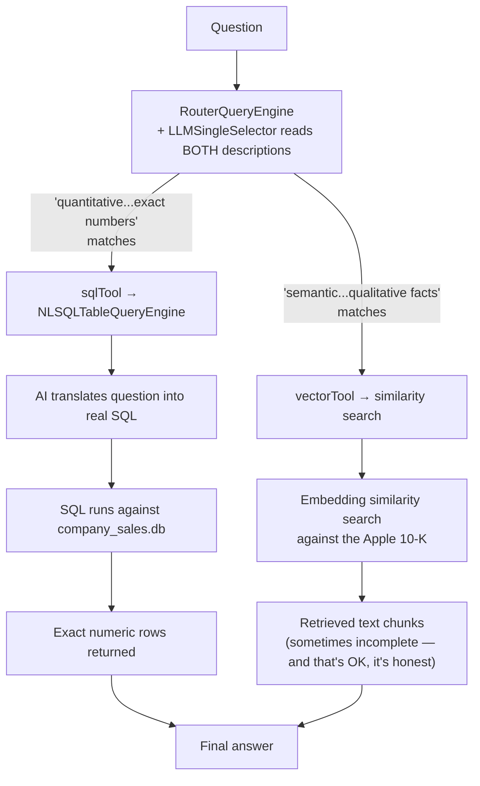

# Day 4. Teaching the System That Not Every Question Needs a Search Engine

## What problem was I solving today?

Imagine asking someone "What was your exact revenue in Q3?" versus "What's your company's general strategy for growth?" The first question has one precise, correct numeric answer sitting in a spreadsheet somewhere. The second is a matter of reading and understanding a paragraph of text. Using the same tool for both is like using a dictionary to look up a phone number, technically possible, but the wrong tool for the job. Day 4 built a second "brain", an actual small SQL database and taught the system to notice, per question, whether it needed exact numbers (go to the database) or a general understanding (go to your document search).

## What did I actually type, and what does it mean?

**Cell 1 — Building a real (tiny) database from scratch**
```python
engine = create_engine("sqlite:///company_sales.db")
revenueTable = Table(
    "revenue_stats", metadataObj,
    Column("year", Integer),
    Column("quarter", String(16), primary_key=True),
    Column("revenue_millions", Integer),
)
metadataObj.create_all(engine)

with engine.begin() as connection:
    connection.execute(revenueTable.insert(), [
        {"year": 2023, "quarter": "Q1", "revenue_millions": 94836},
        {"year": 2023, "quarter": "Q2", "revenue_millions": 81797},
        {"year": 2023, "quarter": "Q3", "revenue_millions": 89498},
        {"year": 2023, "quarter": "Q4", "revenue_millions": 119575}
    ])
```
SQLAlchemy is a Python library that lets you describe a database table using Python code instead of raw database language. `Table(...)` describes the shape (a `year`, a `quarter`, and a `revenue_millions` column), `metadataObj.create_all(engine)` actually builds that shape as a real file on your computer called `company_sales.db`, and the `connection.execute(...)` block fills it with four rows of quarterly numbers. It's worth being honest about what this is and isn't: this is a small, hand-made sample database built specifically to prove the idea works, not a live, automatic extraction from the real 10-K document, a genuinely useful next step, if you ever wanted to take this further, would be writing code that reads the real 10-K tables and inserts them into a database exactly like this one automatically.

**Cell 3. Two engines that answer questions in completely different ways**
```python
sqlDatabase = SQLDatabase(engine, include_tables=["revenue_stats"])
sqlQueryEngine = NLSQLTableQueryEngine(sql_database=sqlDatabase)
vectorQueryEngine = index.as_query_engine()
```
This is the most important line to understand slowly: `NLSQLTableQueryEngine`. This tool does something genuinely different from everything else you've built. It takes your plain-English question, has the AI model **translate it into real SQL code**, actually runs that SQL against your tiny database, and returns the real numeric result. This is called "text-to-SQL," and it's a completely different technique from RAG (which finds *similar-sounding text*, not *exact numbers*). `vectorQueryEngine`, by contrast, is exactly the kind of search you've been using all along, finding chunks of text that are semantically close to your question.

**Cell 4. The router that chooses between them**
```python
sqlTool = QueryEngineTool.from_defaults(
    query_engine=sqlQueryEngine,
    description="Useful for quantitative questions involving exact revenue numbers, specific years, quarters, or sums/averages."
)
vectorTool = QueryEngineTool.from_defaults(
    query_engine=vectorQueryEngine,
    description="Useful for semantic questions about business strategy, risks, company history, and qualitative facts."
)
routerEngine = RouterQueryEngine(
    selector=LLMSingleSelector.from_defaults(),
    query_engine_tools=[sqlTool, vectorTool],
)
```
`LLMSingleSelector` is a built-in LlamaIndex feature that reads both tool descriptions and picks exactly one, based purely on the wording of those two descriptions. Notice the words doing the real work: "quantitative... exact numbers" for the SQL tool, versus "semantic... qualitative facts" for the vector tool. This is the exact same idea as Day 2's tool descriptions, just applied one level higher instead of choosing between "my documents" and "the internet," it's choosing between "a calculator-style database" and "a search-style document reader."

## What actually happened when I ran it

The question *"What was the tool revenue for the year 2023?"* (a small typo for "total revenue," but the router understood the intent anyway) correctly went to the SQL tool, which produced:
```
The SQL response is: [(94836,), (81797,), (89498,), (119575,)]
Therefore, the total tool revenue for the year 2023 is 385706 million.
```
Every one of the four raw quarterly numbers you inserted by hand came back exactly as stored, summed correctly to $385,706 million. real proof this wasn't retrieving *text about* revenue, it was running *actual arithmetic* against *actually stored numbers*.

A second question, asking about qualitative risk factors, was routed to the vector tool instead and returned an honest, partial answer:
```
Result: The primary risk factors are not explicitly stated in the provided information...
```
This is worth appreciating rather than being disappointed by the system didn't make up a confident-sounding list of risks it couldn't actually find. It told you plainly that the specific information wasn't in what it retrieved. This kind of honest "I don't fully know" is exactly the behavior your Reviewer (Day 11) and your 20-question Audit (Day 13) are built to catch and measure systematically, instead of you having to notice it by eye every single time.

## The flow of Day 4



## Why this mattered for later days

This day quietly plants an idea that comes back in a much bigger way later: **not all information retrieval is the same kind of retrieval**. A system that only ever does similarity search will always struggle with precise numeric questions, because "find text that sounds similar" and "compute an exact sum" are fundamentally different jobs. You won't build another SQL tool for the rest of this journey, but the underlying idea, route different *kinds* of questions to different *kinds* of backends, becomes the SIMPLE/COMPLEX/UNKNOWN router you build on Day 12, and eventually the four separate memory tiers you build in Week 4.
