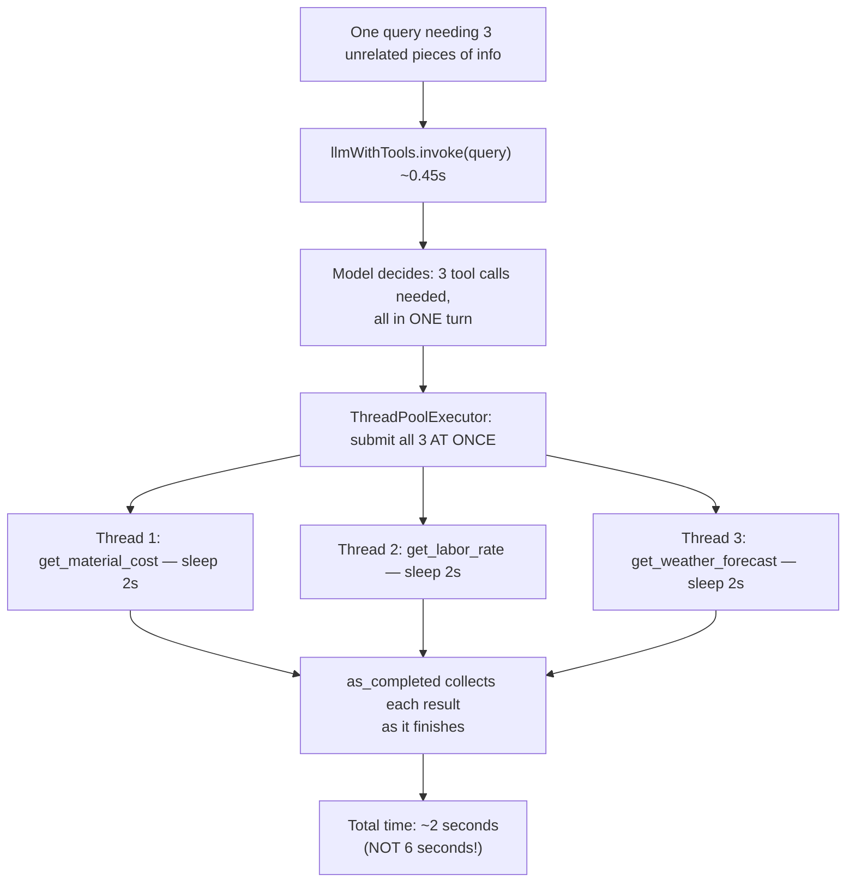

# Day 5 — Doing Three Things at Once Instead of One After Another

## What problem was I solving today?

If you needed to know the price of cement, the daily rate for a mason, and tomorrow's weather forecast, you wouldn't call three separate people one at a time and wait for each call to finish before dialing the next. You'd want all three answers at once. Every agent you built before Day 5 called its tools one after another, even when the tools had nothing to do with each other. Day 5 proved — with a real stopwatch, not just theory — that running independent tasks *at the same time* instead of *one after another* can make your system three times faster.

## What did I actually type, and what does it mean?

**Cell 0 — Tools with fake "slowness" built in on purpose**
```python
@tool
def get_material_cost(material_type: str) -> str:
    """Gets the current market cost for a specific construction material."""
    time.sleep(2)  # simulating network/ database latency
    costs = {"cement": "35,000 UGX per bag", "bricks": "250 UGX per brick"}
    return costs.get(material_type.lower(), "Cost unknown")
```
`time.sleep(2)` deliberately pauses the function for 2 seconds before it answers. This might look strange — why would you want your own code to be slower on purpose? The answer is that this is the entire point of the experiment. In a real production system, a tool call to a database or another website genuinely does take real time. If you tested your speed-up idea using instant fake tools, three calls would already run so fast that you'd never notice the difference between "one at a time" and "all together." Adding a deliberate 2-second pause to three separate tools is what makes the timing difference actually visible and measurable.

**Cell 2 — Switching libraries: LangChain from here on**
```python
from langchain_core.tools import tool
llm = ChatGroq(model='llama-3.3-70B-versatile', api_key=os.getenv('GROQ_API_KEY'), temperature=0)
llmWithTools = llm.bind_tools(tools=tools)
```
Worth noticing explicitly: Days 1 through 4 all used LlamaIndex (`FunctionTool`, `ReActAgent`, `QueryEngineTool`). From Day 5 onward, you switch to LangChain (`@tool`, `ChatGroq`, `.bind_tools()`) — this is the toolkit you'll use for the rest of the whole journey, all the way through the LangGraph work in Week 3 and the memory work in Week 4.

**Cell 3 — Measuring how fast the model decides, separately from how fast the tools run**
```python
start_time = time.time()
ai_msg = llmWithTools.invoke(query)
endTime = time.time()
print(f"LLM decision time: {endTime - start_time:.2f} seconds")
```
This measured only the time it took for the AI model to *decide* which tools to call — before any of those tools had actually run yet. The result was 0.45 seconds, and the model correctly identified that it needed all three tools at once from a single sentence describing three separate needs.

**Cell 4 — The real speed trick: ThreadPoolExecutor**
```python
def execute_tool(tool_call):
    selectedTool = toolMap[tool_call['name']]
    result = selectedTool.invoke(tool_call['args'])
    return f"Result from {tool_call['name']}: {result}"

with concurrent.futures.ThreadPoolExecutor() as executor:
    futureToTool = {
        executor.submit(execute_tool, tool_call): tool_call
        for tool_call in ai_msg.tool_calls
    }
    for future in concurrent.futures.as_completed(futureToTool):
        results.append(future.result())
```
Here's a simple way to picture `ThreadPoolExecutor`: instead of you personally walking to three different shops one after another, you send three different friends, each to one shop, at the same time, and then you just wait by the door for whichever friend gets back first. `executor.submit(...)` sends a friend off. `as_completed(...)` collects results in whatever order they actually finish — not necessarily the order you sent them in. Because each of your three tools sleeps for 2 seconds, if they ran one after another (like a normal loop) the total time would be roughly 6 seconds. Running them together should take roughly 2 seconds — the length of the *slowest single tool*, not the sum of all three.

## The flow of Day 5



## Why this mattered for later days

The speed-up here only works because the three tool calls didn't depend on each other's answers — none of them needed to know what the others found before it could run. This distinction matters a lot: Day 10's Plan-and-Execute pattern deliberately handles the *opposite* situation, where step 3 genuinely needs step 2's answer before it can even start, and running those steps "at the same time" would just produce wrong, incomplete results. Knowing the difference between "these can run together" and "these must run in order" is a real skill you'll keep using.
