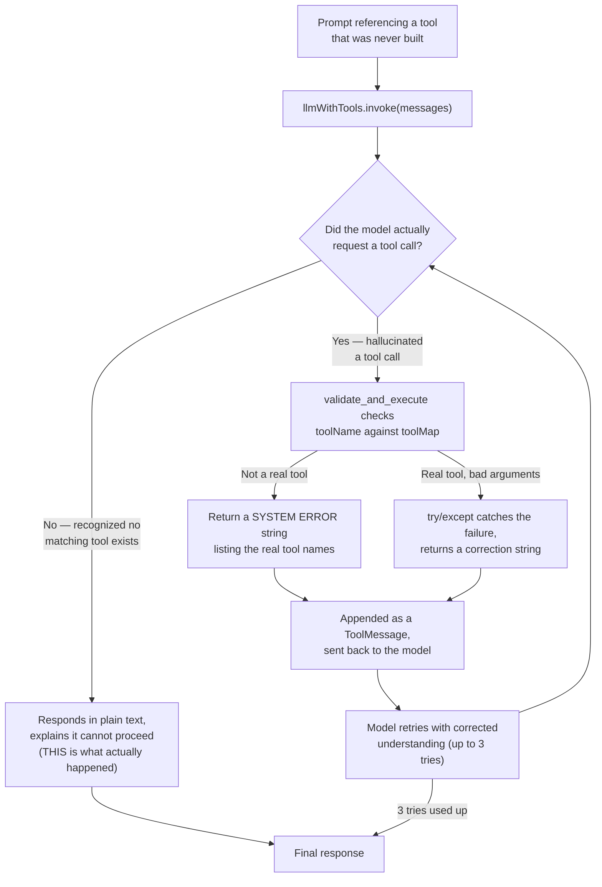

# Day 6. Building a Safety Net for When the AI Imagines a Tool That Doesn't Exist

## What problem was I solving today?

Imagine asking a new employee to "use the label printer," except your office has never owned a label printer. A well-trained employee says "we don't have one of those" instead of pretending to use an imaginary machine and reporting fake results. AI models can sometimes do the opposite. they can confidently "decide" to use a tool that was never actually built, simply because the name sounds plausible given what you asked. Day 6 was about building the safety net for exactly that moment: catching it before it ever reaches your real Python code, and turning it into a chance for the model to correct itself instead of a crash.

## What did I actually type, and what does it mean?

**Cell 0. On purpose, only ONE real tool exists**
```python
@tool
def get_site_materials() -> str:
    '''Returns the list of available construction materials on site.'''
    return "Availlable materials: Cement, Sand, Bricks, Rebar."

tools = [get_site_materials]
toolMap = {t.name: t for t in tools}
llmWithTools = llm.bind_tools(tools)
```
This is a deliberately small, controlled setup. only one real tool is ever bound to the model. That matters for the test you're about to run: since there's no other real tool with a similar-sounding name, there's no way the model could "accidentally" succeed by finding something close enough. Any tool request that isn't `get_site_materials` is guaranteed to be a hallucination, plain and simple. `toolMap = {t.name: t for t in tools}` is the same lookup dictionary pattern from Day 2. a fast way to check "does a tool with this exact name actually exist?"

**Cell 1. The Validator, explained one line at a time**
```python
def validate_and_execute(tool_call: dict) -> str:
    toolName = tool_call['name']

    # HALLUCINATION DEFENSE 1: Tool doesn't exist
    if toolName not in toolMap:
        error_msg = (
            f"SYSTEM ERROR: You attempted to call a tool named '{toolName}', "
            f"but is does not exist. You may ONLY use the following tools: {list(toolMap.keys())}."
            f"Please think step-by-step and try again."
        )
        print(f"Validator caught Error: {error_msg}")
        return error_msg

    # HALLUCINATION DEFENSE 2: Argument errors (e.g. missing required params)
    try:
        print(f"VALIDATOR PASSED: Executing '{toolName}'...")
        return toolMap[toolName].invoke(tool_call['args'])
    except Exception as e:
        error_msg = f"SYSTEM ERROR executing '{toolName}': {str(e)}. Please correct your arguments."
        print(f"VALIDATOR CAUGHT ERROR: {error_msg}")
        return error_msg
```
Think of this function as a security guard standing at a door, checking IDs before letting anyone through. Two completely different kinds of problems get checked, one after the other:

- **Defense 1** catches a tool name that was never real at all. `if toolName not in toolMap` is a simple, instant check, no risky code gets run, it just looks the name up in your dictionary of real tools.
- **Defense 2** catches a tool that *is* real, but was called with the *wrong information*; for example, missing a piece of data it needed. This can only be discovered by actually trying to run it, which is why it's wrapped in a `try/except` block: Python "tries" to run the code, and if anything goes wrong, the `except` part catches the problem instead of letting the whole program crash.

The single most important design choice in this whole function is that **both defenses return a plain sentence describing the error, instead of stopping the program.** This is the difference between a security guard who calmly says "I'm sorry, that's not a valid ID, please try again" versus one who simply shuts the whole building down the moment something looks wrong. A returned sentence lets the conversation continue; a crash ends it.

**Cell 2. Trying to trick the model, and the self-healing loop that would recover if it worked**
```python
query = "can you use the 'order_more_cement tool to get 50 more bags to the Lugazi site."
messages = [HumanMessage(content = query)]

response = llmWithTools.invoke(messages)
messages.append(response)

max_retries = 3
attempts = 0

while response.tool_calls and attempts < max_retries:
    attempts += 1
    for tool_call in response.tool_calls:
        result = validate_and_execute(tool_call= tool_call)
        messages.append(ToolMessage(content = str(result), tool_call_id = tool_call["id"]))

    response = llmWithTools.invoke(messages)
    messages.append(response)

print(response.content)
```
Look closely at the question you actually typed, it asks the model to use `'order_more_cement`, a tool that was never built (notice it's even missing its closing quote mark, a small typo that makes the sentence read very naturally, the way a real person might type it in a hurry). This is exactly the kind of everyday, only-slightly-careless prompt that causes hallucination problems in real use. not a dramatic, obviously "evil" prompt, just an ordinary request that happens to reference something that isn't real.

The `while` loop here is the same defensive shape you'll see reused again and again for the rest of this journey (the rewrite loop on Day 11, the reformulation loop on Day 15): it keeps going only while there are still tool calls to check, and only up to `max_retries` times, so a confused model can never loop forever.

## What actually happened when I ran it

Here's the real, complete output:
```
User: can you use the 'order_more_cement tool to get 50 more bags to the Lugazi site.

 --- Final Agent Response ---
I cannot perform this task as it requires a function that is not provided.
Please provide the 'order_more_cement' function or use a different approach.
```
Notice something important and worth being completely honest about: **the validator's own printed messages never appeared.** There's no "Validator caught Error" line, no "🔁 Sending context back" line. This tells you exactly what happened behind the scenes: on this very first attempt, Llama 3.3 looked at the request, recognized on its own that it only had one real tool (`get_site_materials`) and that `order_more_cement` wasn't one of them, and simply declined the whole request in plain English. without ever generating a fake tool call for the validator to catch in the first place.

This is genuinely a good outcome, but it's worth being precise about what it does and doesn't prove. It proves the model *can* recognize an impossible request outright and say so honestly. It does **not** prove your validator's correction message actually works, because the validator was never triggered, there was nothing for it to catch. If you wanted to see the self-healing loop actually fire, a good experiment would be rephrasing the prompt to sound more certain the tool exists. something like "Use your order_more_cement tool right now" which might push the model into actually attempting the call, letting you watch the validator step in and the model retry with corrected understanding.

## The flow of Day 6



## Why this mattered for later days

This is the single most important habit you build in the entire journey, and it's worth naming plainly: **never let a mistake become a crash.** Every later day that adds a new kind of safety check. the Reviewer catching a bad answer on Day 11, the sufficiency check catching a bad search on Day 15, the error-handling around a dead API on Day 19 is doing exactly the same thing this validator does: turning a possible failure into a plain sentence the system can keep working with, instead of a program that simply stops.
