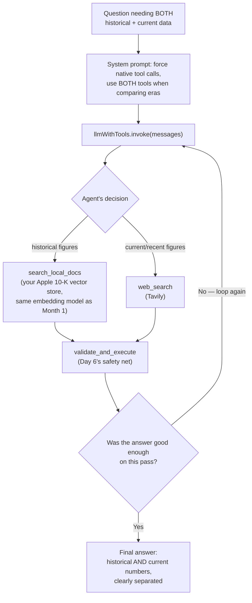

# Day 7 — The Week 1 Capstone: Putting Everything Together Into One Agent

## What problem was I solving today?

Think back to everything Week 1 taught you separately: Day 1 taught you how a tool's description works. Day 2 taught you how to choose between two tools. Day 3 taught you to force real math instead of guessed math. Day 4 taught you to route between totally different kinds of storage. Day 5 taught you to run independent things at the same time. Day 6 taught you to catch a hallucinated tool safely. Day 7's job was to take all six of those separate lessons and fuse them into one finished, polished agent — proving that a whole week of small lessons really does add up to one working system, not just six disconnected exercises.

## What did I actually type, and what does it mean?

**Cell 0 — Setting up, and matching your embedding model exactly**
```python
llm = ChatGroq(model= 'llama-3.3-70B-versatile', api_key= os.getenv('GROQ_API_KEY'), temperature= 0)

Settings.embed_model = HuggingFaceEmbedding(model_name= 'BAAI/bge-m3')

web_search = TavilySearchResults(max_results = 3)
web_search.name = "web_search"
```
Here's a detail that's easy to skip past but genuinely important: `Settings.embed_model = HuggingFaceEmbedding(model_name='BAAI/bge-m3')`. When you built your vector store back in Month 1, you turned the Apple 10-K into number-fingerprints using one *specific* embedding model. If you ever search that same vector store using a *different* embedding model, the "fingerprints" won't line up correctly — it's a bit like trying to match fingerprints taken with two completely different scanning machines. Setting this explicitly, every time you reconnect, guarantees your searches stay compatible with the data that's already stored.

You'll also notice, sitting in the notebook as a comment rather than real code, an earlier idea for a third fake tool (`get_apple_docs`) that was written out but never actually used. It's a small, honest window into how real development actually works — you sketch an idea, decide it isn't needed once the two real tools cover the case well enough, and just leave the note behind rather than deleting your thinking process.

**Cell 2 — The document search tool, unchanged from Day 2**
This is the exact same `search_local_docs` function you wrote on Day 2, complete with its very specific instruction to the model about how to phrase its own search queries ("Convert queries into strict financial line items"). Reusing it here, unchanged, is itself a small proof that Day 2's version was already solid enough to become a permanent building block.

**Cell 4 — A more carefully engineered system prompt**
```python
messages = [
    SystemMessage(content=("You are a precise dual-retrieval research assistant.\n"
        "CRITICAL GUIDELINES:\n"
        "1. If a query asks to compare historical data with recent, current, or 'last year' figures,"
        "you MUST use both tools...\n"
        "2. The local documents contain historical Apple inc. financial records...\n"
        "Do not print raw textual tool calls like '<function\\...>' or explain what you are about to do."
        "Execute the native tool calls directly."
    )),
    HumanMessage(content=query)]
```
Compare this to Day 2's version, and you'll notice a new rule that wasn't there before: an explicit instruction telling the model *not* to print out fake tool-call-looking text like `<function...>` and to instead use the *real* function-calling mechanism. This is a genuinely useful, real piece of prompt engineering — some AI models occasionally get confused and try to "act out" a tool call as plain text instead of actually triggering one, and adding this one blunt sentence heads that off before it happens.

## What actually happened when I ran it

Two tests were run back to back. The first, a pure web-search question, correctly triggered `web_search` on the very first try and returned a real, current answer about Apple's AI strategy and a new "Spatial Reframing" photo feature — genuine live information the model could only have gotten from an actual internet search.

The second question — asking to compare your own stored historical numbers to a more recent published figure — needed both tools, and here's the real trace of what happened:
```
--- Loop iteration 1 ---
🤝 Agent chose: search_local_docs
😁VALIDATOR PASSED: Executing 'search_local_docs' ...
🤝 Agent chose: web_search
😁VALIDATOR PASSED: Executing 'web_search' ...

--- Loop iteration 2 ---
🤝 Agent chose: search_local_docs
😁VALIDATOR PASSED: Executing 'search_local_docs' ...
🤝 Agent chose: web_search
😁VALIDATOR PASSED: Executing 'web_search' ...

------Final Agent Response ------
The sales in your vector store by year are as follows:
* 2024: $391,035 million
* 2023: $383,285 million
* 2022: $394,328 million
The Apple sales published last year were:
* 2023: $383 billion
```
Notice this took **two full loop iterations**, not one — the agent called both tools, wasn't satisfied on the first pass, and called both again before it felt confident enough to answer. Every safety net you built across the whole week is visibly present in this one trace: the validator printed "PASSED" for every real tool call (Day 6), the routing decision correctly picked both tools for a question that genuinely needed both (Day 2), and the final answer correctly separated your own historical numbers from the newly searched current figure without mixing them up.

## The flow of Day 7



## Why this mattered for later days

Day 7 is proof, not new material — and that's exactly its value. Every single piece used today (the vector store connection, the validator, the dual-tool decision-making) was already built earlier in the week. What Day 7 demonstrates is that these pieces genuinely *compose* — they fit together into something bigger without needing to be rewritten. This is the same idea you'll see again at a much larger scale on Day 20, when an entire week's worth of separate LangGraph lessons gets fused into one "Graph Sprint," and again on Day 25, when four entire weeks of memory work get tested together in one final integration check.
