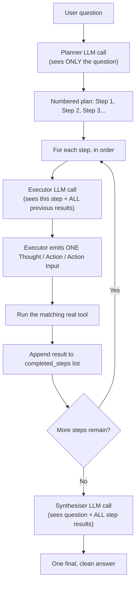

# Day 10 — Two Separate Brains: One That Plans, One That Does

## What problem was I solving today?

Imagine planning a road trip. One way to do it is to just start driving and figure out each turn as you reach it — that's ReAct, what you built on Days 8 and 9. Another way is to sit down first with a map, write out the whole route from start to finish, and only *then* start driving, following your written plan step by step. Day 10 built that second style, called **Plan-and-Execute**, using two genuinely separate AI calls: one whose only job is to write the plan, and a second whose only job is to carry it out, one step at a time.

## What did I actually type, and what does it mean?

**Cell 3 — The Planner: writes a checklist and does nothing else**
```python
PLANNER_SYSTEM_PROMPT = """You are a precise task planner.
Given a user question, produce a numbered step-by-step plan to answer it.

Rules:
- Each step must be a single, concrete action.
- Steps must use ONLY these tools: search_local_docs, get_doc_years, calculator
- If a step depends on the result of a previous step, say so explicitly
- Output ONLY the numbered list, no preamble, no explanation
"""

def plan(question: str) -> list[str]:
    response = client.chat.completions.create(..., temperature= 0)
    raw_plan = response.choices[0].message.content
    steps = re.findall(r"\d+\.\s*(.+)", raw_plan)
    return steps
```
The Planner never touches a tool and never gives a real answer — its entire job is to look at the question and hand back a numbered list, nothing else. `re.findall(r"\d+\.\s*(.+)", raw_plan)` is a regex that looks for the shape "a digit, a dot, some space, then the rest of the line" — and it finds *every* line matching that shape, not just the first one, which is exactly what you need to pull a whole numbered list out of one block of text. Notice the rule "Output ONLY the numbered list, no preamble" — this is there specifically so the regex doesn't accidentally scoop up an unrelated sentence the model might otherwise write before the list starts.

**Cell 4 — The Executor: does exactly one step, with memory of what came before**
```python
def execute_step(step: str, completed_steps: list[dict]) -> str:
    context = ""
    if completed_steps:
        context = "\n\nPrevious steps and their results:\n"
        for i, s in enumerate(completed_steps, 1):
            context += f"Step {i}: {s['step']}\nResult: {s['result']}\n\n"

    prompt = f"{context}Current step to execute: {step}"
    response = client.chat.completions.create(..., stop=["Observation"])
    ...
```
This is the piece that makes multi-step plans actually work. Every time `execute_step` runs, it's handed not just the current step, but a neatly formatted summary of *every step that already happened and what it found* — the `completed_steps` list. This means step 4 can genuinely "see" what step 2 discovered, without you needing any special memory system; it's simply included as plain text at the top of the prompt every single time. This is a lighter-weight cousin of the same idea Week 4 builds much more elaborately with Redis and MongoDB.

**Cell 5 — The Synthesiser: turns raw results into one clean answer**
```python
SYNTHESISER_PROMPT = """You are a precise answer writer.
Given a user question and the results of every step taken to answer it,
write a clear , concise final answer in 2-4 sentences.
Do not mention the steps or tools - just answer the question directly.
"""
```
After every step has run, you don't want to hand the user a messy transcript of "Step 1 found X, Step 2 found Y..." — you want one clean, direct sentence. The Synthesiser's whole job is that final polish: take everything gathered and turn it into something that reads like a real answer, not a work log.

**Cell 6 — The full three-phase runner**
```python
def run_plan_and_execute(question: str) -> str:
    steps = plan(question= question)
    completed_steps = []
    for i, step in enumerate(steps, 1):
        result = execute_step(step, completed_steps= completed_steps)
        completed_steps.append({"step": step, "result": result})
    final_answer = synthesise(question, completed_steps)
    ...
    return final_answer
```
Compare this shape to Day 8's `while` loop, and the difference is stark: there's no uncertainty here about how many times to loop, because the number of steps was already decided, in full, before any tool was ever touched. This is inherently more predictable than ReAct — you know the shape of the whole plan before execution even starts, which makes it much easier to debug when something goes wrong, since you can look at the plan itself and immediately see if the *plan* was bad, separately from whether the *execution* of that plan was bad.

## What actually happened when I ran it

Three genuinely hard, multi-step financial questions were tested — the exact kind that stressed Day 8 and 9's more improvised ReAct approach. The first question — "find total net sales, then calculate what percent came from iPhone revenue" — produced this real plan:
```
1. Use search_local_docs to find the Apple 10-K document for fiscal year 2024
2. Use search_local_docs to find total net sales in the document from step 1
3. Use search_local_docs to find iPhone revenue in the document from step 1
4. Use calculator to divide iPhone revenue from step 3 by total net sales from step 2
5. Use calculator to multiply the result from step 4 by 100 to get the percentage
```
This is a genuinely well-structured plan — it correctly identifies that steps 4 and 5 depend on steps 2 and 3, and it correctly separates "find the numbers" from "do the math," matching exactly the discipline Day 3 taught about never letting the AI calculate in its head.

The clearest full success came from the third question, about liquidity: the system correctly found Apple's cash position and current liabilities from two separate searches, then handed both real numbers to the calculator, producing:
```
"Apple's cash and cash equivalents at the end of FY2024 were $29,943 million.
The total current liabilities were $176,392 million. The current liquidity
ratio is 0.17, calculated by dividing cash and cash equivalents by total
current liabilities."
```
If you check that math yourself — $29,943 million ÷ $176,392 million — you get almost exactly 0.17, confirming the whole three-phase pipeline (plan, execute each step with memory of the last, synthesise) worked correctly end to end on a genuinely multi-step question.

## The flow of Day 10



## Why this mattered for later days

Plan-and-Execute and ReAct aren't a case of one replacing the other — they're two different tools for two different situations, and knowing when to reach for which one is a real skill. ReAct is more flexible and can react to surprises mid-conversation; Plan-and-Execute is more predictable and handles long, structured tasks more reliably. This exact tension — "should this question follow a fixed plan, or reason step by step as it goes?" — comes back explicitly on Day 12, when you build a router that decides, per question, which style of thinking to use.
