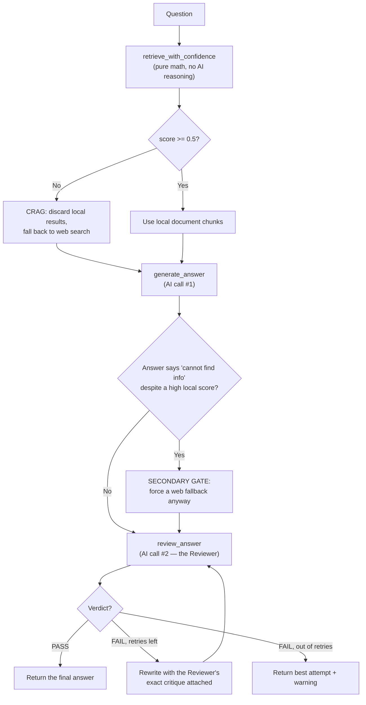

# Day 11 — Teaching the System to Catch Its Own Mistakes

## What problem was I solving today?

Every system you've built so far trusted two things without question: that its search actually found the right information, and that its answer actually used that information correctly. Day 11 stopped trusting both. You built two independent safety checks — one that runs *before* the answer is written (checking whether the search results were even good enough to use), and one that runs *after* (checking whether the written answer actually matches what was found). Think of it like a kitchen with two separate inspections: one checking the ingredients before cooking starts, one checking the finished dish before it leaves the kitchen.

## What did I actually type, and what does it mean?

**Cell 2 — Turning a search result into a trust score**
```python
RELEVANCE_THRESHOLD = 0.5

def retrieve_with_confidence(query: str) -> tuple[list, float]:
    retriever = index.as_retriever(similarity_top_k = 4)
    results = retriever.retrieve(query)
    if not results:
        return [], 0.0
    top_score = float(results[0].score) if results[0].score is not None else 0.0
    print(f"📣 Top retrieval score : {top_score:.3f} (threshold: {RELEVANCE_THRESHOLD})")
    return results, top_score
```
Every result your vector search returns comes with a **similarity score** — a number describing how closely that piece of text matches your question, mathematically. `top_score` grabs the score of the very best result. This function does no thinking at all, it's pure arithmetic — which is exactly why it belongs *before* the expensive step of actually generating an answer. It's much cheaper to check a number than to run a whole AI generation and then discover the search was bad all along.

**Cell 3 — Corrective RAG: the cheap gate that runs first**
```python
def corrective_retrieve(query: str) -> tuple[str, str]:
    docs, top_score = retrieve_with_confidence(query)
    if top_score < RELEVANCE_THRESHOLD or not docs:
        print("🤥 CRAG: Low retrieval confidence - falling back to web search")
        webResults = webSearch.invoke(query)
        context = "\n\n".join([r["content"] for r in webResults])
        return context, "web"
    else:
        print("👍 CRAG: Retrieval confidence acceptable - using local docs")
        return format_chunks(docs), "local"
```
This is a single `if` statement doing genuinely important work: if the best match your own documents could offer scores below 0.5 (out of a possible 1.0), the system doesn't even try to answer from your documents — it assumes they probably don't contain what's needed and automatically switches to a live web search instead. This is "Corrective RAG" (often shortened to CRAG) — instead of blindly trusting whatever came back from search, the system checks first whether that search was even worth trusting.

**Cell 4 — The generator, and a real, deliberate model swap**
```python
def generate_answer(question: str, context: str, critique: str = "") -> str:
    ...
    response = client.chat.completions.create(
        model = "openai/gpt-oss-120b",
        ...
    )
```
Worth calling out honestly: from this cell onward, the generator switched to a different model — `openai/gpt-oss-120b` — instead of the `llama-3.3-70b-versatile` model used everywhere up to this point. Groq hosts several different AI models, and this is a real, deliberate experiment worth noticing: different models can have different strengths, and part of building real systems is being willing to try alternatives rather than assuming your first choice is automatically the best one forever.

**Cell 5 — The Reviewer: a second AI checking the first AI's work**
```python
def review_answer(question: str, context: str, answer: str) -> tuple[str, str]:
    response = client.chat.completions.create(
        model = 'openai/gpt-oss-120b',
        messages = [
            {"role": "system", "content": REVIEWER_SYSTEM_PROMPT},
            {"role": "user", "content": (
                f"Question: {question}\n\nSource Context:\n{context}\n\nGenerated Answer:\n{answer}"
            )}
        ], temperature= 0
    )
    raw = response.choices[0].message.content
    verdict_match = re.search(r"Verdict:\s*(PASS|FAIL)", raw)
    ...
    return verdict, reason
```
Notice what the Reviewer is shown: the original question, the exact source material the first answer was built from, and the answer itself. Its whole job is to compare the answer against the source and decide if the answer is actually backed up by what was found, or if it's making claims the source doesn't support (this is called **hallucination**). This is genuinely a different kind of check than CRAG's — CRAG checks *"was the search good?"* using pure math; the Reviewer checks *"was the answer faithful to what was found?"* using a second round of AI reasoning.

**Cell 6 — A real, extra safety net Rodney added beyond the original plan**
```python
# SECONDARY GATE to catch false-positive vector scores
if answer and "I cannot find sufficient information" in answer and source == "local":
    print("🤥 CRAG: Local docs failed to answer despite high vector score. Forcing web fallback...")
    webResults = webSearch.invoke(question)
    context = "\n\n".join([r["content"] for r in webResults])
    source = "web"
    answer = generate_answer(question, context= context)
```
This is worth pointing out specifically because it wasn't part of the original plan — it's a genuine improvement made while actually building the system. Here's the problem it solves: sometimes the *similarity score* looks confidently high, but the actual retrieved text still doesn't contain what's needed (a "false positive" — the math said "trust this," but the content didn't deliver). This extra check catches that specific gap: if the local documents scored high enough to be trusted, but the model still ended up saying "I cannot find sufficient information," that's a signal the score lied, and the system automatically tries the web instead of just giving up.

**Cell 6 continued — the rewrite loop, capped so it can't run forever**
```python
attempts = 0
verdict = 'FAIL'
while verdict == 'FAIL' and attempts < max_rewrites:
    verdict, critique = review_answer(question= question, context= context, answer= answer)
    if verdict == 'FAIL':
        attempts += 1
        if attempts < max_rewrites:
            answer = generate_answer(question, context, critique)
        else:
            print("🤥 Max rewrites reached - returning best attempt with warning")
```
If the Reviewer says `FAIL`, the system doesn't just give up or crash — it sends the answer back to be rewritten, this time including the Reviewer's specific critique, so the second attempt has a real chance to fix the exact problem that was flagged. `max_rewrites = 2` is the safety cap — the same defensive pattern you've now seen multiple times (Day 6's tool retries, Day 8's step limit): always put a hard ceiling on any loop that depends on an AI deciding when to stop.

## What actually happened when I ran it

Three real questions were tested, and the results were genuinely strong. Question 1 — comparing FY2024 and FY2023 net sales — scored a retrieval confidence of **0.875** (comfortably above the 0.5 threshold), generated a correct answer on the first try, and the Reviewer confirmed **PASS** immediately, with zero rewrites needed:
```
Apple's total net sales were $391,035 million for fiscal year 2024.
For fiscal year 2023, total net sales were $383,285 million.
Comparison: FY 2024 net sales were $7,750 million higher than FY 2023,
representing an increase of roughly 2% year-over-year.
```
Question 2, about macroeconomic risk factors, scored 0.833 confidence and also passed on the first try, correctly citing specific real figures from the document (a $2,755 million portfolio impact from a hypothetical rate rise, and a $139 million interest expense change).

Question 3 was the real test of the CRAG fallback — asking for Apple's *current* stock price, something no 10-K filing could ever contain. The system correctly recognized this, automatically switched `retrieval_source` to `"web"`, and returned a real, current answer: **$282.50 per share, roughly $4.168 trillion market capitalization** — genuinely live information the local documents could never have supplied. All three questions passed with **zero rewrites needed** — a genuinely clean run.

## The flow of Day 11



## Why this mattered for later days

Two different kinds of "wrong" got two different kinds of check today: a bad *search* is caught cheaply with a number (CRAG), and a bad *answer* is caught expensively with real reasoning (the Reviewer). This exact two-layer thinking — a fast, cheap check first, a slower, smarter check second — becomes the backbone of the router you build on Day 12 (which decides how much of this expensive machinery a question actually deserves) and the 20-question audit on Day 13 (which finally measures, with real numbers, how often each layer actually catches something).
