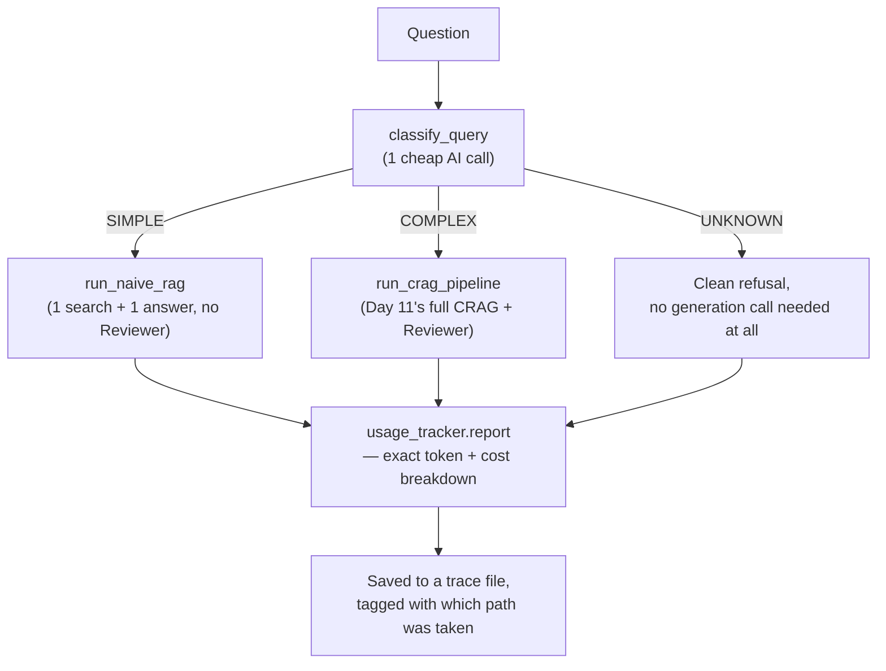

# Day 12. Not Every Question Deserves the Expensive Treatment

## What problem was I solving today?

Day 11's CRAG-plus-Reviewer pipeline is thorough, but thoroughness costs money and time. it can mean three or more separate AI calls just to answer one question. That's overkill for something as simple as "What was Apple's net income?" Day 12 built a front door: a cheap classifier that reads each question first and decides whether it's simple enough for a quick, one-step answer, or complicated enough to deserve the full Day 11 treatment. It's the same instinct as not hiring a whole team of inspectors to check whether a light bulb is screwed in correctly.

## What did I actually type, and what does it mean?

**Cell 9. Tracking exactly what every AI call costs, automatically**
```python
def tracked_llm_call(messages: list, system: str = "") -> str:
    full_messages = []
    if system:
        full_messages.append({"role": "system", "content": system})
    full_messages.extend(messages)

    response = client.chat.completions.create(
        model = "openai/gpt-oss-120b",
        messages= full_messages,
        temperature= 0,
    )
    usage_tracker.add(response.usage)
    return response.choices[0].message.content
```
This function is a **wrapper**  it does exactly what a normal AI call does, but adds one extra step: `usage_tracker.add(response.usage)`. Every AI response secretly includes information about how many "tokens" (small chunks of text) it used, both in what you sent and what it sent back. By routing every single call through this one function instead of calling Groq directly everywhere, every part of your system automatically gets counted, without you needing to remember to track it by hand in twenty different places.

**Cell 10 — The Router: three categories, each with a worked example**
```python
ROUTER_SYSTEM_PROMPT = """You are a query complexity classifier for a financial RAG system.

Classify the user's question as one of:
- SIMPLE: a single factual lookup requiring one retrieval and one answer
(e.g. "What was Apple's net income in FY2024?")
- COMPLEX: requires multiple steps, comparisons, calculations, or chaining
(e.g. "Compare iPhone revenue across FY2023 and FY2024 and calculate the growth rate")
- UNKNOWN: cannot be answered from a financial document at all
(e.g. "What is the weather in Cupertino today?")
...
"""

def classify_query(question: str) -> tuple[str, str]:
    raw = tracked_llm_call(messages=[...], system= ROUTER_SYSTEM_PROMPT)
    classification_match = re.search(r"Classification:\s*(SIMPLE|COMPLEX|UNKNOWN)", raw)
    ...
    return classification, reason
```
Notice each of the three categories comes with a real example question, not just an abstract description. This matters more than it might seem, a vague category name like "hard question" gives the AI very little to anchor a decision on, while a concrete example question next to each label gives it something specific to compare against.

**Cell 11. The cheap path: one search, one answer, nothing else**
```python
def run_naive_rag(question: str) -> dict:
    docs, score = retrieve_with_confidence(question)
    context = "\n\n --- \n\n".join([doc.node.get_content() for doc in docs])
    answer = tracked_llm_call(
        messages=[{"role": "user", "content": f"Context:\n{context}\n\nQuestion: {question}"}],
        system = NAIVE_RAG_SYSTEM_PROMPT
    )
    return {"path": "naive_rag", "question": question, "answer": answer, ...}
```
No Reviewer, no rewrite loop, no CRAG web fallback. just one search and one generation. This is deliberately the cheapest possible path through the system, reserved only for questions the router genuinely believes are simple.

**Cell 12. The router itself, and a bug worth understanding honestly**
```python
def run_router(question: str) -> dict:
    classification, reason = classify_query(question)

    if classification== 'SIMPLE':
        result = run_naive_rag(question= question)
    elif classification == "COMPLEX":
        result = run_crag_pipeline(question= question)
        result['path'] = "agentic_rag"
    else:
        result = {"path": "unknown", ...}

    result["Classification"] = classification
    result["classification_reason"] = reason
    ...
    return result
```
Look very closely at the second-to-last line: `result["Classification"] = classification` — with a **capital C**. This is a small, completely understandable typo, and it's worth flagging honestly rather than glossing over, because it has a real consequence: any later code that checks for a *lowercase* `result["classification"]` will never find it, and will silently assume the classification is missing every single time. You'll see exactly this happen on Day 13, and it's a genuinely valuable, real example of why testing your code against real data (like the audit on Day 13 does) is so important. this exact kind of tiny, easy-to-miss typo is precisely the kind of bug that a careful test catches and a quick glance at the code does not.

## What actually happened when I ran it

Six real questions were sent through the router: three deliberately simple, three deliberately complex  and the routing decisions were all correct. For "What was Apple's total net sales for the fiscal year 2024?" the router chose **SIMPLE**, reasoning: *"It asks for a single factual figure that can be answered with one retrieval."* The naive path answered correctly  **$391,035 million** using only 2 AI calls and costing an estimated **$0.006105**.

For the complex question: comparing iPhone revenue across two years and calculating the percentage change the router correctly chose **COMPLEX** and routed to the full CRAG + Reviewer pipeline, which produced:
```
Apple's iPhone net sales were:
- FY 2023: $200,583 million
- FY 2024: $201,183 million

Year-over-year change: (201,183 - 200,583) / 200,583 × 100 ≈ 0.30%

Result: iPhone revenue increased by about 0.3% from FY 2023 to FY 2024.
```
And the Reviewer confirmed: **PASS — the answer correctly uses the iPhone revenue figures**. Every single one of the six test questions was routed correctly and answered accurately, with real, itemized cost tracking proving that the SIMPLE questions genuinely cost less than the COMPLEX ones exactly the outcome this whole day was built to achieve.

## The flow of Day 12



## Why this mattered for later days

The router doesn't make your system smarter. it makes the *same* intelligence cheaper to run. A SIMPLE question answered by the naive path and the exact same question forced through the full agentic pipeline should get the same correct answer; the only real difference is how much time and money it took to get there. This exact cost-consciousness becomes very important once you reach Week 4, where every extra AI call needed to check memory, extract facts, or resolve entities adds up fast across a long conversation.
