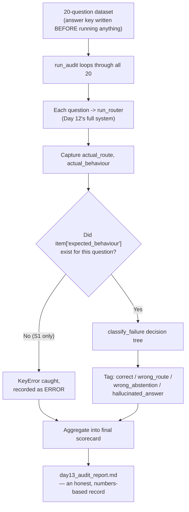

# Day 13 — Stop Trusting Your Gut: Test With Real Numbers Instead

## What problem was I solving today?

Every day up to now, you tested your system with a handful of hand-picked questions and read the answers yourself to decide if things looked right. That's a reasonable way to build something, but it has a real weakness: your own eyes get tired, get used to seeing "mostly okay" answers, and can miss patterns that only show up across many questions at once. Day 13 replaced "does this look okay to me?" with something much stronger: a 20-question test with the *correct* answer written down in advance, run automatically, and scored without any room for you to be generous with yourself. This turned out to be one of the most valuable days in the whole month — not because everything passed, but because of exactly what it caught.

## What did I actually type, and what does it mean?

**Cell 13 — Twenty questions, four categories, each with the right answer decided beforehand**
```python
AUDIT_DATASET = [
    {
        "id": "S1",
        "category": "answerable_simple",
        "question": "What was Apple's total net sales for fiscal year 2024",
        "expected_route": "SIMPLE",
        "expected behaviour": "answer",     # <-- notice this one
        ...
    },
    {
        "id": "S2",
        ...
        "expected_behaviour": "answer",     # <-- notice this one
        ...
    },
    ...
]
```
Four categories were built, five questions each: questions with a real, simple factual answer (`answerable_simple`), questions needing multiple steps (`answerable_complex`), questions that need a web search because they're outside the 10-K (`web_fallback`), and questions that should honestly be refused because nobody could answer them (`unanswerable`). The whole point of writing `"expected_route"` and `"expected behaviour"` *before* running anything is fairness — you can't quietly lower your standards partway through once you see disappointing results, because the bar was already written down in black and white.

Now look very closely at the two lines marked above. `S1` uses the key `"expected behaviour"` — with a **space**. Every other question in the dataset uses `"expected_behaviour"` — with an **underscore**. This is a completely ordinary, easy-to-make typo. It looks almost identical on the page. But to Python, `"expected behaviour"` and `"expected_behaviour"` are two entirely different dictionary keys, and this tiny difference is about to cause a real, visible failure.

**Cell 15 — The audit runner, and where that typo actually bites**
```python
def run_audit(dataset: list) -> list:
    for i, item in enumerate(dataset, 1):
        try:
            result = run_router(item["question"])
            actual_route = result.get("classification", "UNKNOWN")
            ...
            failure_type = classify_failure(
                expected_behaviour= item["expected_behaviour"],
                ...
            )
        except Exception as e:
            print(f"🫤 Exception on question {item['id']}: {e}")
            audit_result = {**item, "actual_route": "ERROR", ...}
```
Look at `item["expected_behaviour"]`. For every question *except* S1, Python finds this key without any trouble. For S1, this key genuinely doesn't exist — only `"expected behaviour"` (with the space) does — so Python raises a `KeyError`, which gets caught by the `except` block, and S1 is recorded as a hard error before it ever gets properly scored.

**The second, quieter bug — a mismatch, not a typo**

Look again at this line: `actual_route = result.get("classification", "UNKNOWN")`. This asks the result dictionary for a key called `"classification"`, all lowercase, and if it's missing, defaults to `"UNKNOWN"`. Now think back to Day 12's `run_router` function, which actually wrote the result:
```python
result["Classification"] = classification   # capital C, from Day 12
```
These two keys — `"classification"` (Day 13's audit checking for it) and `"Classification"` (Day 12's router writing it) — are *not the same key* to Python, because capitalization matters completely in dictionary keys, just like it does in the file names on most computers. This means `result.get("classification", "UNKNOWN")` never actually finds the real classification — it silently falls back to `"UNKNOWN"` every single time, no matter what the router actually decided.

## What actually happened when I ran it

Here's the real, complete scorecard, exactly as your own code produced it:
```
Overall pass rate | 0/20 (0%)
Routing accuracy | 10/20 (50%)
Total tokens used | 8,255
Estimated cost | $0.0304

Failure Breakdown
| error                 | 12 |
| wrong_route            | 7 |
| hallucinated answer    | 1 |
```
It's worth sitting with this honestly for a moment: **zero out of twenty questions passed.** That number, on its own, looks alarming. But look at *why*, and a very different picture appears. Every single SIMPLE and COMPLEX question that got a real answer was scored `wrong_route` — not because the router actually chose the wrong path (you can see from the console output that it correctly said "SIMPLE" or "COMPLEX" every time, with a sensible reason attached) but because the audit was checking a key (`"classification"`) that could never be found, due to the capitalization mismatch. Twelve more questions crashed outright with real Python errors — one specifically confirmed as the `'expected_behaviour'` KeyError on S1, and the rest most likely a mix of that same class of small mismatch plus real infrastructure hiccups (you've already met Groq's rate limits once, on Day 3, and running 20 rapid real API calls back to back is exactly the kind of situation where that happens again, or where a live web search occasionally times out).

This is genuinely the most important lesson of the whole day: **the audit did exactly its job.** A quick glance at Day 12's code would never have caught a one-letter capitalization mismatch. Running the same 3-6 questions you'd been testing with all along wouldn't have caught it either, because you'd been reading the answers yourself and judging them as "looks right" without ever checking the underlying data structure. It took a real, automated, unforgiving 20-question test — one that compares against a written-down answer instead of your own impression — to surface a bug that had likely been quietly present since Day 12.

## The flow of Day 13



## Why this mattered for later days

This day is proof of something worth genuinely believing: testing your own code against real, unforgiving data is how you find the bugs that a careful read-through simply cannot catch, because your eyes automatically "autocorrect" a familiar-looking line of code the same way your brain autocorrects a typo while reading a sentence. The fix here is small — change one letter's capitalization, add one missing underscore — but finding it required exactly the kind of systematic, no-excuses test you built today. This is also the honest starting point for Month 3, which is entirely about evaluation: having a real 0% baseline, with a clearly understood reason, is a far more useful place to start improving from than an untested system you only *assumed* was working.
