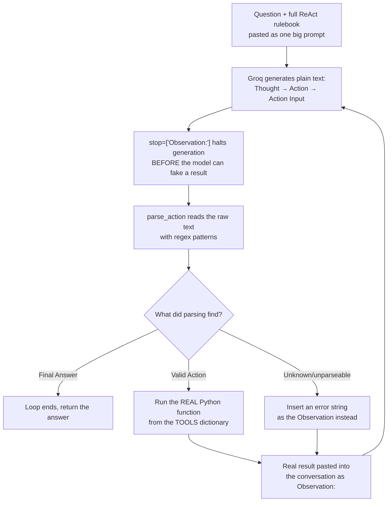

# Day 8. Writing "ReAct" From Scratch, With No Shortcuts

## What problem was I solving today?

Every agent you built in Week 1 used a convenient shortcut: `bind_tools()`, which quietly does a lot of complicated work behind the scenes to let the model call your functions. Day 8 was about deliberately turning that convenience *off*. Instead of using the built-in tool-calling feature, you made the AI model write out its thinking in plain English text "Thought," "Action," "Action Input" and you wrote your own code to read that plain text and figure out what to do next. This is like learning to do long division by hand even though your calculator can do it instantly: it's slower, but it teaches you exactly what the calculator was doing for you all along.

## What did I actually type, and what does it mean?

**Cell 2. Plain Python functions, not `@tool`-wrapped ones**
```python
def search_local_docs(query:str) -> str:
    """Searches my local Knowledge base containing historical Apple 10-K financial documents..."""
    retriever = index.as_retriever(similarity_top_k = 4)
    results = retriever.retrieve(query)
    return "\n\n".join([doc.node.get_content() for doc in results])

def get_doc_years(_: str = "") -> str:
    """Returns the list of available years in the 10k pdf"""
    return "Available years: 2021, 2022, 2023"

def calculator(expression: str) -> str:
    """Evaluates a basic math expression and literally anything to do with math calculations."""
    try:
        return str(eval(expression))
    except Exception as e:
        return f"Error: {e}"

TOOLS = {
    "search_local_docs": search_local_docs,
    "get_doc_years": get_doc_years,
    "calculator": calculator,
}
```
Notice these are just ordinary functions with no decorator on top of them at all — no `@tool`. Since you're not using the built-in tool-calling feature today, there's no schema to generate; the model will never "see" these functions directly. Instead, `TOOLS` is a plain dictionary you'll check yourself, by hand, once the model tells you in plain text which one it wants. `get_doc_years` is a small placeholder it always claims the same three years are available, regardless of what's actually true, which becomes an interesting detail once you see the real output below.

**Cell 3. The entire "contract" is one big string of instructions**
```python
REACT_SYSTEM_PROMPT = """You are a careful search assistant that solves problems step by step

You have access to these tools:
-search_local_docs(query): searches the user's local pdf documents.
-get_doc_years(): lists the number of years available in the apple 10K document.
-calculator(expression): evaluates a math expression

Use EXACTLY this format, one step at a time:

Thought: <your reasoning about what to do next>
Action: <one of: search_local_docs, get_doc_years, calculator>
Action Input: <the input to the tool>
...
"""
```
This is genuinely the whole rulebook. There's no schema, no `bind_tools`, nothing enforcing this structure except the words themselves. This is why the next cell (the parser) matters so much if the model ever writes something even slightly different from this exact format, your code has to be ready to notice and handle it gracefully.

**Cell 4. The parser: teaching Python to read the model's plain-text answer**
```python
def parse_action(text: str):
    action_match = re.search(r"Action:\s*(\w+)", text)
    input_match = re.search(r"Action Input:\s*(.+)", text)
    final_match = re.search(r"Final Answer:\s*(.+)", text, re.DOTALL)

    if final_match:
        return None, None, final_match.group(1).strip()

    action = action_match.group(1).strip() if action_match else None
    action_input = input_match.group(1).strip() if input_match else None
    return action, action_input, None
```
`re.search(...)` is Python's tool for finding a specific pattern inside a big block of text, this is called a **regular expression**, or "regex" for short. Think of it like using Ctrl+F to search a document, except instead of finding an exact word, you're finding a *shape* of text: `r"Action:\s*(\w+)"` means "find the word 'Action:', followed by any amount of blank space, followed by one word and give me that one word." This function checks for three possible things in the model's raw text, in order: is there a Final Answer? If yes, we're done. If not, is there an Action and an Action Input? Return those. If none of these patterns match at all, all three come back empty, and the code calling this function has to decide what to do about that (you'll see that decision in Cell 5).

**Cell 5. The loop, and the one line doing the most important safety work**
```python
def run_react_loop(question: str, max_steps: int = 6):
    conversation = f"{REACT_SYSTEM_PROMPT}\n\nQuestion: {question}\n"

    for step in range(max_steps):
        response = client.chat.completions.create(
            model = "llama-3.3-70B-versatile",
            messages = [{"role": "user", "content": conversation}],
            temperature= 0,
            stop = ["Observation:"]
        )
        text = response.choices[0].message.content
        conversation += f"{text}\n"

        action, action_input, final_answer = parse_action(text)

        if final_answer:
            return final_answer

        if action and action in TOOLS:
            observation = TOOLS[action](action_input)
        elif action:
            observation = f"Error: tool '{action}' does not exist. Available tools: {list(TOOLS.keys())}"
        else:
            observation = "Error: could not parse an Action. Please follow the Thought/Action/Action Input format exactly."

        conversation += f"Observation: {observation}\n"

    return None
```
Read `stop = ["Observation:"]` closely, this is the single most important line in the whole day. It's an instruction to Groq itself: "the moment the model starts typing the literal word 'Observation:', stop generating immediately." Without this, the model, having just been shown the exact format including "Observation:" would happily *predict* what the observation probably says and write it out itself, without ever actually running your real Python function. This one setting is what physically forces the model to stop and wait for the *real* answer instead of guessing a fake one.

Also notice `conversation` is a single, ever-growing string. Every step, the model's new thinking gets pasted onto the end, and so does the real observation. By the time the loop reaches step 3 or 4, the model can "see" its own earlier reasoning and the real results it already gathered, all inside one long piece of text. this is how the conversation "remembers" earlier steps without any special memory system (that comes much later, in Week 4).

## What actually happened when I ran it

The question was: *"How many years are listed in my document and what are the revenues for each according to the document?"* Here's what genuinely happened, step by step:

**Step 1:** The model reasoned it needed to check `get_doc_years` first, called it, and got back: `"Available years: 2021, 2022, 2023"`  but remember, this is a placeholder function that always says the same thing regardless of the truth.

**Step 2:** The model then searched the real documents for those years' revenues, and the real Apple 10-K data came back — a genuine table showing figures for 2024, 2023, and 2022 (not 2021 at all).

**The final answer**, and this is the important part:
```
The revenues for 2022 and 2023 are $394,328 and $383,285, respectively.
We were unable to find the revenue for 2021.
```
This is a small but genuinely good sign about how the system behaves. The placeholder tool confidently claimed "2021" was available, but when the model went and actually searched the real documents, it couldn't find 2021 data there and instead of making up a number to satisfy the earlier claim, it honestly reported that 2021 was missing. This is exactly the kind of honesty about missing information that Day 4 also showed you, and it's a pattern worth being glad to see repeating.

## The flow of Day 8



## Why this mattered for later days

Everything you'll build starting Day 14 — LangGraph's nodes, edges, and state is, underneath, doing a more organized and more reliable version of exactly what you did by hand today: read the model's decision, run the right function, feed the result back in, repeat. Having built this manually once means that when LangGraph starts hiding these mechanics behind cleaner code, you'll know exactly what's happening underneath instead of just trusting a black box.
