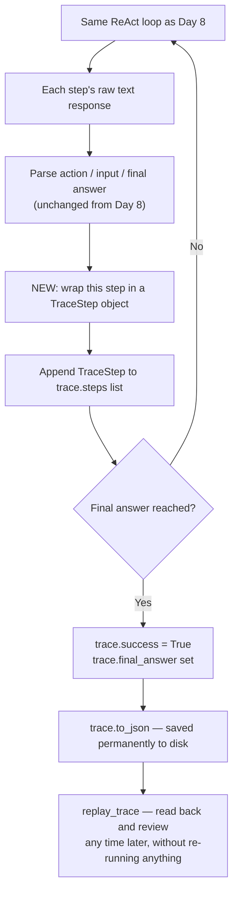

# Day 9. Building a Camera That Records Every Thought the Agent Has

## What problem was I solving today?

Yesterday's loop printed everything to your screen, which is great while you're watching it live but the moment you close the notebook, all of that is gone forever. Imagine a detective who solves every case correctly but never writes anything down in a case file, brilliant in the moment, useless for reviewing later, useless for training a new detective, useless for spotting a pattern across many cases. Day 9 was about building that case file: a structured, saveable record of every single thought, action, and result your agent produces, so you can review it, replay it, or feed it into other tools later without ever needing to run the agent again.

## What did I actually type, and what does it mean?

**Cell 0. Two blueprints for structured data: `TraceStep` and `ReActTrace`**
```python
@dataclass
class TraceStep:
    step_number: int
    timestamp: str
    raw_llm_output: str
    parsed_action: Optional[str]
    parsed_action_input: Optional[str]
    observation: Optional[str]
    is_final_answer: bool
    is_error_recovery: bool

@dataclass
class ReActTrace:
    question: str
    final_answer: Optional[str]
    total_steps: int
    success: bool
    started_at: str
    finished_at: str
    steps: list[TraceStep] = field(default_factory= list)
```
A `@dataclass` is Python's way of quickly building a labelled container instead of a plain dictionary where you might accidentally misspell a key name, a dataclass locks in exactly which pieces of information belong together and what type each one should be. `TraceStep` is like one page in the case file. a single moment in time. `ReActTrace` is the whole case file. one question, and a growing list of every `TraceStep` that happened while trying to answer it.

There's a small but genuinely important detail here: `steps: list[TraceStep] = field(default_factory=list)`. Why not just write `steps: list = []`? Because in Python, if you set a mutable default value like an empty list directly, *every single* `ReActTrace` you ever create would secretly share the *exact same* list, adding a step to one trace would mysteriously appear inside every other trace too. `field(default_factory=list)` tells Python "give each new `ReActTrace` its own, brand-new, empty list," avoiding that trap entirely.

**Cell 0 continued — saving and loading**
```python
def to_json(self, filepath: str):
    with open(filepath, "w") as f:
        json.dump(asdict(self), f, indent = 2)
    print(f"👍 Trace saved to {filepath}")

@classmethod
def from_json(cls, filepath: str):
    with open(filepath) as f:
        data = json.load(f)
    steps = [TraceStep(**s) for s in data.pop("steps")]
    trace = cls(**data)
    trace.steps = steps
    return trace
```
`asdict(self)` converts your neat dataclass back into a plain dictionary that `json.dump` knows how to write to a file. `from_json` does the reverse trick: it reads the file back and carefully rebuilds each `TraceStep` object one at a time before rebuilding the full `ReActTrace` around them. this two-step rebuild is necessary because a plain JSON file doesn't know about your custom Python classes, so you have to tell it explicitly how to reconstruct them.

**Cell 2. Two small, real improvements to yesterday's system prompt**
```python
REACT_SYSTEM_PROMPT = """...
-calculator(expression): evaluates a math expression. CRITICAL: Only use this tool if the
user's question explicitly requires a mathematical calculation. DO NOT use it to add up
calendar years or calculate unprompted statistics from the data table.
...
CRITICAL EXIT CONDITION: After you receive an Observation, if that observation contains the
direct answer to the user's question, you must STOP making tool calls and output your Final
Answer. Do not perform extra unnecessary steps.
..."""
```
Two new rules were added today, and both come from a very sensible instinct: stop the agent from wasting steps. The calculator rule stops it from doing pointless unrequested math just because a tool happens to be available. The "CRITICAL EXIT CONDITION" rule stops it from continuing to search or reason after it already has everything it needs a subtle but real efficiency improvement, since every extra step costs both time and tokens.

**Cell 3. Wrapping yesterday's loop so it writes to the case file instead of just the screen**
```python
def run_logged_react_loop(question: str, max_steps: int = 10) -> ReActTrace:
    ...
    trace = ReActTrace(question=question, final_answer=None, total_steps=0,
                        success=False, started_at=started_at, finished_at="")
    for step_num in range(1, max_steps + 1):
        timestamp = datetime.now().isoformat()
        response = client.chat.completions.create(..., stop=["Observation:"])
        raw_output = response.choices[0].message.content
        action, action_input, final_answer = parse_action(raw_output)
        ...
        trace.steps.append(TraceStep(step_number=step_num, timestamp=timestamp, ...))
    trace.total_steps = len(trace.steps)
    trace.finished_at = datetime.now().isoformat()
    return trace
```
Compare this carefully to Day 8's loop, and you'll notice something worth appreciating: the actual reasoning logic, the `stop=["Observation:"]`, the parsing, the tool execution is completely unchanged. All that's new is that every step now *also* gets wrapped in a `TraceStep` and appended to `trace.steps`, in addition to being printed as before. This is a genuinely good way to add new capability to working code: add it *alongside* what already works, rather than rewriting the whole thing and risking breaking something that used to work fine.

**Cell 4 — The replay function**
```python
def replay_trace(trace: ReActTrace):
    print(f"Question: {trace.question}")
    print(f"Success: {trace.success}")
    for step in trace.steps:
        print(f"\n[step {step.step_number}] {step.timestamp}")
        if step.is_error_recovery:
            print("🫤 ERROE RECOVERY STEP")
        print(step.raw_llm_output)
        if step.observation:
            print(f"Observation: {step.observation}")
        if step.is_final_answer:
            print(f"\n👍 Final Answer: {trace.final_answer}")
```
This function does nothing new computationally. it just reads a saved trace and prints it out in a clean, readable way. Its real value is that you can call it on a trace loaded from a file *days later*, without ever needing to spend API calls or wait for the model to run again. This is the beginning of an important idea: separating *doing* the work from *reviewing* the work.

## What actually happened when I ran it

Three questions were sent through the logged loop, and the very first one is genuinely worth reading closely: *"what years are available in my docs?"* Here's what actually happened, honestly, warts and all:

**Step 1:** The model reasoned that since the question was about "your docs" generally (not specifically the Apple 10-K), it should use `search_local_docs` rather than the year-listing tool a sensible, careful distinction. But the search came back with fairly vague context about fiscal year definitions, not a clean list of years.

**Step 2:** Not satisfied, the model tried searching again with slightly different wording ("list of years in local documents"). This time it noticed the document mentioned "2024 and 2023" directly in the context of year-to-year comparisons. genuine progress, even though it still hadn't fully answered the question.

**Step 3:** The model kept going, continuing to piece together the answer from partial clues in the real document text rather than giving up or guessing.

This is worth being honest about: the model didn't get a clean, one-step answer to a question that sounds simple. It had to search multiple times, in slightly different ways, gradually building confidence about what years were actually present which is a very human way of researching something, and a good demonstration of *why* having a structured trace matters. If this agent were running inside a bigger system and gave a strange final answer, this trace is exactly what you'd want to open up and read step by step to understand why.

## The flow of Day 9



## Why this mattered for later days

This is the first day your system produces something that outlives the conversation it happened in. Every trace saved today into the `traces/` folder becomes raw material other days can use later — and it's worth remembering this idea comes back explicitly on Day 13, where a whole 20-question audit produces exactly this kind of structured record specifically so you can measure your system's accuracy with real numbers instead of a gut feeling.
