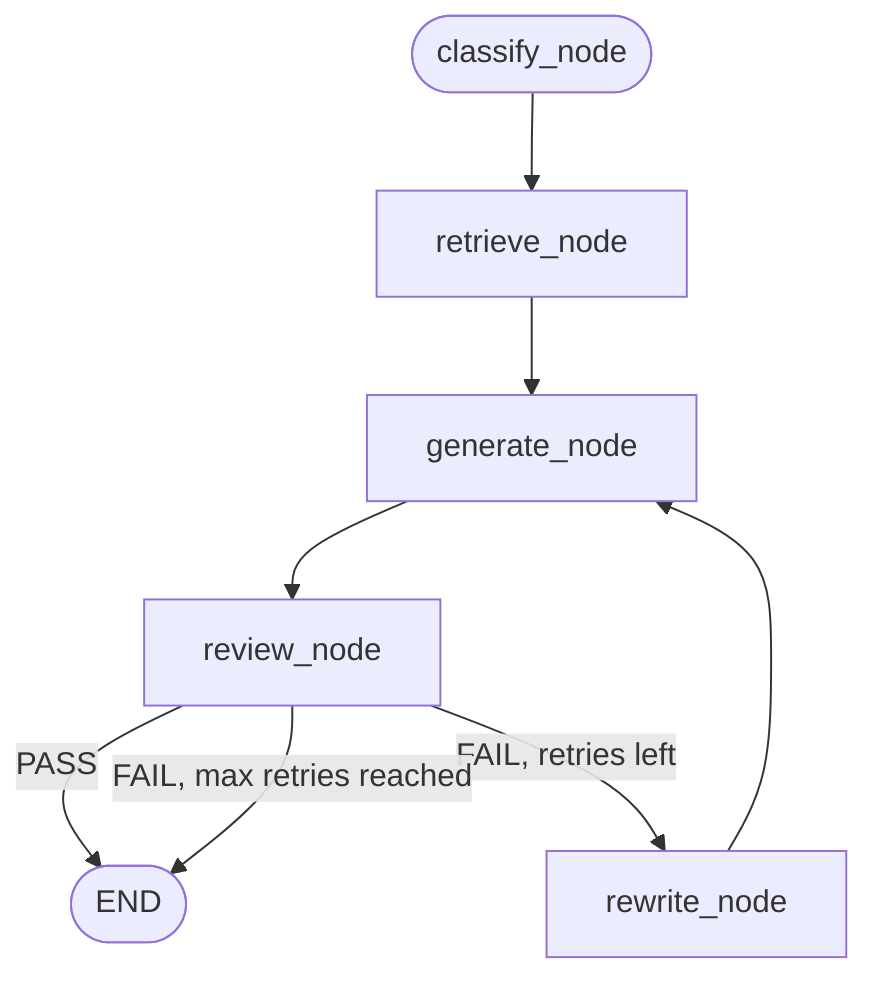

# Day 14. Turning Loose Python Into an Actual Map

## What problem was I solving today?

Everything I built across Week 2, the ReAct loop, the Plan-and-Execute pipeline, CRAG, the Reviewer, the router worked, but it was held together with regular Python: `while` loops, if-statements, and dictionaries passed between functions by hand. That's fine for one person reading the code, but it doesn't draw itself as a picture, it doesn't save its progress automatically, and it's easy to lose track of exactly which piece runs when. Day 14 rebuilt the *exact same logic* from Day 11 using a library called LangGraph, which forces you to describe your system as a literal map: boxes (called **nodes**) and arrows (called **edges**) connecting them, with one shared notebook (called **state**) that every box can read from and write to.

## What did I actually type, and what does it mean?

**Cell 3. State: one shared notebook every node can read and write**
```python
class RAGState(TypedDict):
    question: str
    classification: Optional[str]
    context: Optional[str]
    retrieval_source: Optional[str]
    retrieval_score: Optional[float]
    answer: Optional[str]
    reviewer_verdict: Optional[str]
    reviewer_reason: Optional[str]
    rewrite_count: int
    max_rewrites: int
    warning: Optional[str]
    finished_at: Optional[str]
```
A `TypedDict` is a dictionary with a strict list of allowed keys and the type each one should hold. Think of `RAGState` as a shared clipboard that gets passed from node to node. every node can look at what's already written on it, and every node adds its own notes before passing it along. Every single one of these fields already existed somewhere in Day 11's code, as separate local variables or dictionary entries scattered through different functions. `RAGState` just gathers them all into one official, agreed-upon shape.

**Cell 3 continued Nodes: plain functions that read state and return updates**
```python
def retrieve_node(state: RAGState) -> dict:
    if state["classification"] == "UNKNOWN":
        return {"context": "...", "retrieval_source": "none", "retrieval_score": 0.0}
    docs, score = retrieve_with_confidence(state["question"])
    ...
    return {"context": context, "retrieval_source": source, "retrieval_score": score}
```
Compare this to Day 11's `corrective_retrieve(query: str) -> tuple[str, str]`. The actual retrieval logic inside. checking the confidence score, falling back to the web if it's too low, is identical. What changed is the *shape*: instead of taking a bare string and returning a tuple, a node takes the *entire shared clipboard* (`state`) so it can see anything earlier nodes wrote, and it returns only a small dictionary of the *new* things it's adding. LangGraph automatically merges that small dictionary back into the main clipboard. you never have to manually stitch the pieces together yourself.

**Cell 3 continued. Edges: deciding what happens next**
```python
def route_after_review(state: RAGState) -> Literal["rewrite_node", "__end__"]:
    if state.get("reviewer_verdict") == "PASS":
        return "__end__"
    if state.get("rewrite_count", 0) >= state.get("max_rewrites", 2):
        return "__end__"
    return "rewrite_node"
```
This function makes no AI calls and does no real work. it just reads the clipboard and decides, in plain Python, which box should run next. This is the exact same three-way decision Day 11's `while verdict == 'FAIL' and attempts < max_rewrites:` loop was making just pulled out into its own small, clearly-named function instead of being buried inside a loop's condition.

**Cell 3 continued. Wiring it all together**
```python
graph = StateGraph(RAGState)
graph.add_node("classify_node", classify_node)
graph.add_node("retrieve_node", retrieve_node)
graph.add_node("generate_node", generate_node)
graph.add_node("review_node", review_node)
graph.add_node("rewrite_node", rewrite_node)

graph.set_entry_point("classify_node")
graph.add_edge("classify_node", "retrieve_node")
graph.add_edge("retrieve_node", "generate_node")
graph.add_edge("generate_node", "review_node")
graph.add_edge("rewrite_node", "generate_node")

graph.add_conditional_edges(
    "review_node", route_after_review,
    {"rewrite_node": "rewrite_node", "__end__": END}
)
return graph.compile()
```
`add_edge` is a fixed arrow  "after this box, always go straight to that box," no decision involved. `add_conditional_edges` is different. it hands the current state to a router function (`route_after_review`) and lets that function's return value decide which arrow to actually follow. `graph.compile()` at the end takes this whole description and turns it into a real, runnable object.

**A small, honest detail worth mentioning:** the notebook also defines a `route_after_classify` function, but if you look closely at the wiring above, `classify_node` always goes straight to `retrieve_node` using a plain `add_edge`, not a conditional one. meaning `route_after_classify` is written but never actually connected to anything. This is a completely normal, harmless thing that happens in real development: you sketch out a piece you think you might need, and it turns out the simpler fixed-edge version was enough after all.

## What actually happened when I ran it

While reconnecting to MongoDB Atlas at the start of the notebook, a real, temporary network hiccup occurred:
```
SSL handshake failed: [SSL: TLSV1_ALERT_INTERNAL_ERROR] tlsv1 alert internal error
```
This is worth knowing about honestly. it's a genuine, ordinary network error that can happen when connecting to a cloud database, usually resolved by simply trying again, which is exactly what happened here; the very next attempt connected successfully. It's a small reminder that real systems talking to real cloud services occasionally hit small hiccups that have nothing to do with your code being wrong.

Once connected, the same three evaluation questions from Day 11 were run through the new graph version, and  this is the entire point of today, they produced the **same correct answers** as the hand-written version did. This is proof that Day 14 was a faithful *translation*, not a rewrite that changed behavior. If the graph had given a different answer to the same question Day 11 already answered correctly, that would signal a real bug in how the nodes were wired, not an improvement.

## The flow of Day 14



## Why this mattered for later days

This is a refactor, not new capability and that distinction matters enormously. Everything Days 15 through 20 add new loops, saved progress, a pause for human approval, multiple AI agents working together gets added by drawing *more boxes and arrows onto this same map*, rather than rewriting tangled `while` loops from scratch every time. Today bought you a foundation that's genuinely easier to extend safely.
