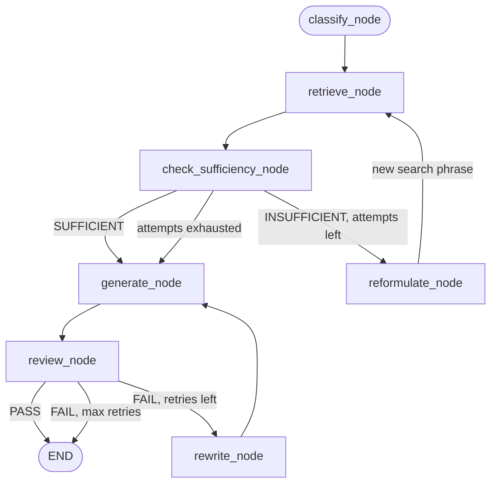

# Day 15. When the Search Itself Was the Problem, Not the Answer

## What problem was I solving today?

Day 14's map trusts that whatever `retrieve_node` finds is good enough to build an answer from the only quality check was CRAG's raw confidence number. But sometimes a search can score *reasonably* well and still miss the actual detail the question needed, simply because the wording of the search didn't match the wording in the document closely enough. Day 15 added a second, smarter checkpoint: an AI actually reads the retrieved text and the question together and asks, plainly, "does this genuinely answer what was asked?" and if not, instead of giving up, it rewrites the search itself and tries again.

## What did I actually type, and what does it mean?

**Cell 3. `retrieve_node` grows exactly one new idea**
```python
def retrieve_node(state: RAGState) -> dict:
    search_query = state.get("reformulated_query") or state["question"]
    docs, score = retrieve_with_confidence(search_query)
    ...
```
This one line is the whole trick that makes a loop possible. The very first time this box runs, `reformulated_query` doesn't exist yet, so it falls back to the plain `question`. But if a *later* box (`reformulate_node`, below) writes a new, improved search phrase onto the shared clipboard, this exact same box runs *again*  except this time it searches using the new phrase instead of the original one. No second retrieval function was needed; you just taught the existing one to check for an upgrade first.

**Cell. The Sufficiency Checker: a narrow, disciplined question**
```python
SUFFICIENCY_SYSTEM_PROMPT = """You are a retrieval sufficiency checker for a financial RAG system.
...
Your job is to determine ONLY whether the context contains enough information
to answer the question - do not answer the question itself.

Respond in EXACTLY this format:
Sufficiency: <SUFFICIENT or INSUFFICIENT>
Reason: <one sentence explaining why>
"""
```
Notice the very deliberate instruction: "do not answer the question itself." This might look like an odd thing to have to say out loud, but it heads off a real, common problem if you don't explicitly forbid it, a helpful-by-nature AI model will often try to sneak in an actual answer while it's supposed to just be judging whether an answer is *possible*, which pollutes the clean SUFFICIENT/INSUFFICIENT signal you actually need.

**Cell. The Reformulator: rewrites the search using the reason it failed**
```python
def reformulate_node(state: RAGState) -> dict:
    raw = tracked_llm_call(
        messages=[{"role": "user", "content": (
            f"Original question: {state['question']}\n\n"
            f"Previous search query that failed: {state.get('reformulated_query') or state['question']}\n\n"
            f"Why it failed: {state.get('sufficiency_reason', '...')}"
        )}],
        system= REFORMULATE_SYSTEM_PROMPT
    )
    new_query = raw.strip()
    return {"reformulated_query": new_query, "retrieval_attempts": new_attempts}
```
This isn't a random second guess. the *reason* the sufficiency checker gave for rejecting the first search gets fed directly into the rewrite prompt. If the reason was something like "the context discusses R&D generally but not the specific FY2024 dollar figure," the new search can specifically chase down that exact gap, rather than blindly trying a vague paraphrase and hoping for the best.

**Cell `route_after_sufficiency`: the loop guard**
```python
def route_after_sufficiency(state: RAGState) -> Literal["generate_node", "reformulate_node"]:
    if verdict == "SUFFICIENT":
        return "generate_node"
    if attempts >= max_attempts:
        return "generate_node"
    return "reformulate_node"
```
Notice what happens even when the attempts run out: the code doesn't throw an error or refuse to continue. it still moves on to `generate_node` with whatever it managed to find. This is a genuinely good design decision. The system tries its best twice, and if it still can't find a perfect match, it doesn't give up entirely; it lets the answer get generated anyway and trusts the *next* layer of safety (Day 11's Reviewer, already wired into this same graph) to catch a bad answer if one results.

## What actually happened when I ran it

The graph was rebuilt with `check_sufficiency_node` and `reformulate_node` newly wired in between `retrieve_node` and `generate_node`, creating the very first genuine **cycle** in the map. a loop where the same box can run more than once inside a single question, something a simple straight-line pipeline could never do. Two test questions were run: one deliberately vague ("Tell me about Apple's spending on new technology and innovation last year"), designed to likely need a reformulation before it found the specific "research and development" wording actually used in the real document, and one genuinely unanswerable question, designed to prove the attempt limit correctly stops the loop instead of spinning forever.

## The flow of Day 15



## Why this mattered for later days

You now have two *completely separate* loop guards living in the same graph: one counting how many times the *search* has been retried, and one counting how many times the *answer* has been rewritten. Keeping them separate matters. a search that needed two attempts to find the right information shouldn't "use up" the answer's own retry budget, because they're answering two genuinely different questions: "was the search good enough?" and "was the answer good enough?" This same idea of layered, independent safety checks becomes even more important once Week 4 adds memory, where a similar question arises about how many times to retry a memory lookup versus a generation.
