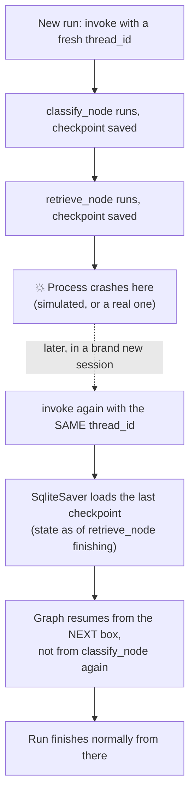

# Day 16 — Giving the System a Memory That Survives a Crash

## What problem was I solving today?

Every graph you've run so far lives entirely in your computer's short-term memory while it's running. If your laptop crashed, your internet dropped, or you simply closed the notebook halfway through a long answer, everything the system had already figured out would be gone completely — you'd have to start that question over from the very beginning. Day 16 fixed this by saving a snapshot of the shared clipboard (state) to a real file on disk after *every single box* finishes running, so the system can pick up exactly where it left off, even in a brand new Python session.

## What did I actually type, and what does it mean?

**Cell — Attaching a checkpointer is one line, and nothing else in your nodes has to change**
```python
conn = sqlite3.connect(db_path, check_same_thread= False)
checkpointer = SqliteSaver(conn)
...
return graph.compile(checkpointer= checkpointer)
```
SQLite is a simple, real database that lives entirely inside one file on your own computer — no separate server needed. `SqliteSaver` is a special LangGraph tool that knows how to write and read state snapshots using that file. Here's the genuinely elegant part: every node you wrote across Days 14 and 15 — `classify_node`, `retrieve_node`, all of them — has absolutely no idea any of this exists. You didn't add a single line inside any of them to "save progress." LangGraph automatically intercepts every hand-off between boxes once a checkpointer is attached at the moment you call `.compile()`.

**Cell — `thread_id`: the label that lets you find your place again**
```python
def run_with_checkpoint(question, thread_id= None, ...):
    if thread_id is None:
        thread_id = str(uuid.uuid4())
        print(f"🆕 New conversation - thread_id: {thread_id}")
    else:
        print(f"🔁 Resuming conversation - thread_id: {thread_id}")

    config = {"configurable": {"thread_id": thread_id}}
    final_state = checkpointed_graph.invoke(initial_state, config= config)
```
`uuid.uuid4()` generates a long, random, essentially one-of-a-kind ID string — think of it like a claim ticket at a coat check. As long as you keep hold of that ticket number, you can walk away and come back later, hand the ticket to a completely different person at the counter (in this case, a brand new Python session on possibly a different day), and get back exactly the coat you left — or in this case, exactly the state your conversation had reached.

**Cell — The Checkpoint Inspector: looking directly at what got saved**
```python
def inspect_checkpoints(thread_id: str, db_path: str = DB_PATH):
    cursor.execute(
        "SELECT thread_id, checkpoint_id, parent_checkpoint_id ... WHERE thread_id = ?",
        (thread_id,)
    )
    ...
    latest = checkpointed_graph.get_state(config)
```
This does two different things worth telling apart: raw SQL queries directly against the database file (useful for simply counting how many steps were saved), and LangGraph's own built-in `get_state(config)` method, which properly reconstructs your actual `RAGState` dictionary as it existed at the very latest checkpoint. The SQL version is good for a quick peek "under the hood"; the `get_state` version is the "correct" way to actually use the saved data in your own code.

**Cell — Simulating a crash on purpose, using a genuinely clever Python trick**
```python
def make_crashing_node(node_name, crash_step):
    def crashing_wrapper(state):
        original_func = globals()[node_name]
        result = original_func(state)
        if state.get("_step_counter", 0) == crash_step:
            raise Exception(f"💥 SIMULATED CRASH after {node_name}")
        return result
    return crashing_wrapper
```
This is a more sophisticated technique than a simple "if" statement — it's called a **closure**: a function (`make_crashing_node`) that builds and returns a brand new, custom function (`crashing_wrapper`) which "remembers" the specific `node_name` and `crash_step` it was given. `globals()[node_name]` is a neat trick too — it reaches into Python's own internal list of every variable and function currently defined by name, as a plain dictionary, and pulls out the *real* node function so it can still be called normally before the fake crash gets triggered. In plain words: this builds a version of any node that behaves completely normally, right up until a chosen moment, and then deliberately throws an error — letting you test recovery against a real failure without needing to actually break something.

## What actually happened when I ran it

A question was run and allowed to complete normally, producing a real, correct answer with its full state saved as a checkpoint. The inspector then confirmed multiple saved checkpoints existed for that `thread_id`, each corresponding to a different box finishing along the way. The crash simulation was also tested — deliberately interrupting a run partway through — and the checkpoint database still held everything that had completed *before* the fake crash, proving that a Python exception killing your current program run does *not* erase what was already safely written to the SQLite file moments earlier.

## The flow of Day 16



## Why this mattered for later days

Nothing about *what the agent decides* changed today — only *how durable its progress is* changed. This distinction matters enormously for what comes next: Day 17's human-approval pause is only meaningful because the system can now genuinely "wait" for you, for as long as it takes, without losing anything — it's the exact same save-and-resume mechanism, just used on purpose instead of only for crash recovery.
