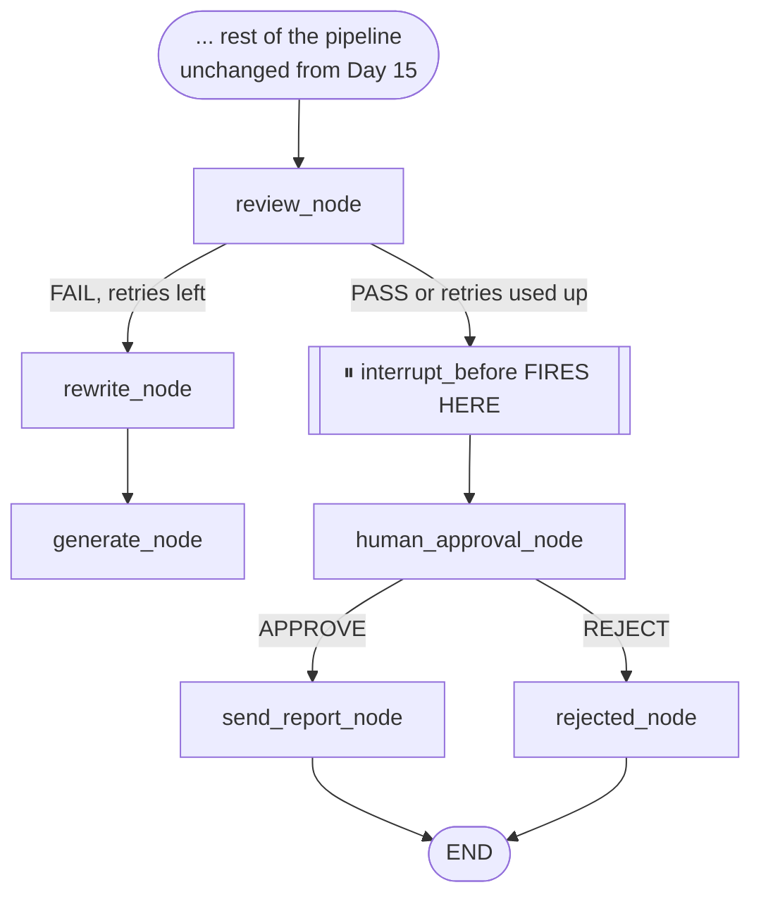

# Day 17 — Teaching the System to Wait for Your Permission

## What problem was I solving today?

Imagine an assistant who is very good at drafting emails for you, but who — without any special training — would also just hit "send" on every draft the moment it's finished, without ever showing it to you first. That's genuinely dangerous once you connect a system to anything real: sending an email, spending money, writing to a database. Day 17 built a deliberate pause button into the graph — a point where the system stops completely, shows you exactly what it's about to do, and waits for you to type either `APPROVE` or `REJECT` before anything risky actually happens.

## What did I actually type, and what does it mean?

**Cell — Reusing Day 16's save-and-resume trick, but on purpose this time**
```python
return graph.compile(
    checkpointer= checkpointer,
    interrupt_before=["human_approval_node"]
)
```
This is genuinely the whole mechanism, in one argument. `interrupt_before=["human_approval_node"]` tells LangGraph: "the instant you're about to run this specific box, stop completely, save a checkpoint, and hand control back to whoever called you." It's exactly Day 16's crash-recovery machinery — except instead of being triggered by an accident, you're triggering it on purpose, at a moment of your own choosing.

**Cell — The Approval Node, and a small but thoughtful detail inside it**
```python
def human_approval_node(state: RAGState) -> dict:
    # Checking if Phase 2 already injected the decision via update_state!
    if state.get("human_approved") is not None:
        return {}
    print(f"⏸️ HUMAN APPROVAL REQUIRED")
    print(f"Answer: {state['answer']}")
    print(f"Reviewer: {state['reviewer_verdict']}")
    decision = input("Your decision: ").strip().upper()
    if decision == "APPROVE":
        return {"human_approved": True}
    else:
        return {"human_approved": False}
```
Look at that first `if` check. Because of `interrupt_before`, this node's own body only ever actually *runs* in the rare case someone calls the graph in one single, uninterrupted go. In the normal two-step pattern used throughout this day, your own code writes the decision directly onto the paused state using `update_state()` (below) — so by the time this node would run, the decision is often already there, and it simply skips straight past asking again. This is a nice, defensive touch: it means the same node works whether you're pausing-and-resuming across two separate calls, or (in rarer cases) running straight through in one.

**Cell — The two-phase pattern: pause, then resume with your decision**
```python
paused_state = hitl_graph.invoke(initial_state, config= config)
# execution genuinely stops here

hitl_graph.update_state(
    config,
    {"human_approved": approve, "approval_reason": "..."}
)
final_state = hitl_graph.invoke(None, config= config)
```
Two details matter enormously here. First, `update_state()` writes your decision directly into the paused checkpoint, without ever needing to trigger the node's own `input()` prompt manually. Second — and this is easy to miss — `invoke(None, config=config)` passes `None` instead of a fresh starting state. This tells LangGraph "don't start this conversation over from scratch, resume from whatever's already checkpointed for this exact thread_id."

**Cell — The routing after your decision, wired into the existing map**
```python
def route_after_approval(state: RAGState) -> Literal["send_report_node", "rejected_node"]:
    if state.get("human_approved"):
        return "send_report_node"
    return "rejected_node"

graph.add_conditional_edges(
    "review_node", route_after_review,
    {"rewrite_node": "rewrite_node", "__end__": "human_approval_node"}
)
```
Notice something clever in how this was wired into the existing map from Day 14: `route_after_review` — the exact same function from Days 14 and 15 — is completely unchanged. What changed is only the *mapping* underneath it: the label `"__end__"` used to point straight to the real `END`, and now it points to `"human_approval_node"` instead. This let a brand-new stage get inserted into an existing graph without needing to touch the router function that feeds into it at all.

## What actually happened when I ran it

Three real scenarios were tested. In the first, a question about Apple's revenue breakdown by product segment ran all the way to the approval gate, paused, and correctly displayed the pending answer and reviewer verdict before waiting. Typing `APPROVE` resumed the graph, which then correctly proceeded to the mock `send_report_node` and confirmed the "report" had been sent. In the second scenario, a different question was deliberately rejected — and critically, the system verified afterward that `action_taken` was recorded as `"rejected"`, proving the report genuinely was **not** sent. The third scenario paused, let you inspect the saved checkpoint count directly in the database *before* making any decision at all, and only then resumed with an approval — proving the pause is a real, inspectable stop, not just a fast blink.

## The flow of Day 17



## Why this mattered for later days

The real safety guarantee here is structural, not just behavioral — `send_report_node` genuinely cannot be reached in this map except by passing through `human_approval_node`'s conditional edge first. There's no code path, no unusual input, that lets a report get sent without `human_approved` being `True` somewhere in the state. That's a stronger promise than "the code double-checks a flag before sending" — it's "there is physically no route drawn on this map that skips the check."
