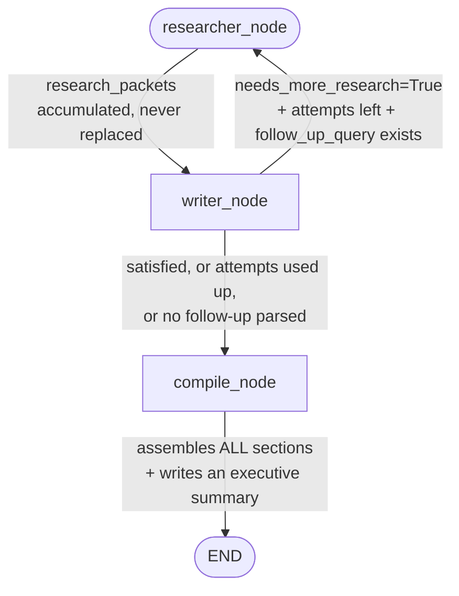

# Day 18 — Two Specialists Instead of One Generalist

## What problem was I solving today?

Every box you've built so far tries to do one small, focused task — classify, retrieve, generate. Day 18 zoomed out and asked a bigger question: what if two *entire AI roles* worked together, the way a real newsroom pairs a researcher with a writer? A researcher's whole job is digging up solid evidence. A writer's whole job is turning evidence into something readable. Neither is good at the other's job, and forcing one person to do both usually makes the result worse at both things. Today you built exactly that pairing — and crucially, gave the Writer the ability to send work *back* to the Researcher if the evidence wasn't good enough yet, making this a genuine back-and-forth collaboration.

## What did I actually type, and what does it mean?

**Cell — The Researcher: structured evidence, never a finished answer**
```python
def researcher_node(state: MultiAgentState) -> dict:
    query = state.get("follow_up_query") or state["current_topic"]
    docs, score = retrieve_with_confidence(query)
    ...
    raw = tracked_llm_call(messages=[...], system= RESEARCHER_SYSTEM_PROMPT)
    evidence_blocks = re.findall(r"EVIDENCE \d+:\nFact: (.+?)\nConfidence: (HIGH|MEDIUM|LOW)", raw, re.DOTALL)
    ...
    existing_packets = state.get("research_packets", [])
    return {"research_packets": existing_packets + [packet], ...}
```
Notice the Researcher is never asked to write anything resembling a final answer — only a short list of specific, confidence-tagged facts. This is a deliberate separation of concerns: keeping the Researcher narrowly focused on "find and tag evidence" stops it from prematurely deciding how the final report should read, which is entirely the Writer's job. Also notice `existing_packets + [packet]` — this *adds* to the list rather than replacing it, meaning if the Writer asks for a second round of research, both the first and second rounds of evidence stay available together.

**Cell — The Writer: prose plus a decision about whether it needs more**
```python
def writer_node(state: MultiAgentState) -> dict:
    all_evidence = []
    for packet in state.get("research_packets", []):
        for ev in packet.get("evidence", []):
            all_evidence.append(f"[{ev['confidence']} confidence] {ev['fact']}")
    ...
    raw = tracked_llm_call(messages=[...], system= WRITER_SYSTEM_PROMPT)
    parts = re.split(r"\nNEEDS_MORE_RESEARCH:", raw, maxsplit=1)
    report_section = parts[0].strip()
    ...
    return {"report_sections": existing_sections + [report_section],
            "needs_more_research": needs_more, "follow_up_query": follow_up}
```
Two genuinely important things happen here. First, the Writer gathers evidence from **every** research packet collected so far, not just the newest one — this is exactly why the Researcher's "add, don't replace" pattern above matters; if the Writer only saw the latest round, an earlier round's evidence could get silently lost. Second, one single AI response is split into two different pieces using `re.split` on a fixed marker text (`"NEEDS_MORE_RESEARCH:"`) — the actual written report section on one side, and the Writer's own judgment about whether it's satisfied on the other. This is the same "split one response into two useful pieces using a reliable marker" trick you first saw in Day 8 and Day 9's Thought/Action/Final Answer parsing.

**Cell — The feedback loop: three conditions must ALL be true to loop back**
```python
def route_after_writer(state: MultiAgentState) -> Literal["researcher_node", "compile_node"]:
    needs_more = state.get("needs_more_research", False)
    attempts = state.get("researcher_attempts", 0)
    max_attempts = state.get("max_researcher_attempts", 3)

    if needs_more and attempts < max_attempts and state.get("follow_up_query"):
        return "researcher_node"
    return "compile_node"
```
Read the `if` condition carefully — it needs *all three* things to be true before looping back: the Writer must genuinely want more research, there must be attempts remaining, **and** there must be an actual follow-up question to search for. That third check is a quiet but important safety net: if the Writer says "yes I need more" but something went wrong parsing out an actual follow-up query, looping back would just repeat the exact same search pointlessly. Better to move on to `compile_node` with what's already been gathered than to spin uselessly.

**Cell — The Compile Node: many sections, one polished document**
```python
def compile_node(state: MultiAgentState) -> dict:
    sections_text = "\n\n".join(state["report_sections"])
    final_report = tracked_llm_call(
        messages=[{"role": "user", "content": f"Report Sections to Compile:\n\n{sections_text}"}],
        system= COMPILE_SYSTEM_PROMPT
    )
    return {"final_report": final_report}
```
The Compile Node is a third, distinct role again — not researching, not writing a section, but *editing*: taking everything gathered and turning it into one coherent document with an executive summary stitched on top.

## What actually happened when I ran it

The full graph — just three boxes and one loop-back arrow, genuinely simpler-looking than several earlier days despite doing something more sophisticated — was compiled and run on real Apple 10-K topics. The Researcher correctly pulled tagged, confidence-rated evidence from the vector store; the Writer correctly turned that evidence into properly headed, paragraph-structured report sections; and the loop-back logic was exercised for real when a topic's first round of evidence was judged insufficient, triggering a second Researcher call with a genuinely different, more specific follow-up query before the Writer was satisfied.

## The flow of Day 18



## Why this mattered for later days

This is the first day where one box's output isn't simply consumed by the *next fixed box in line* — it's consumed by a peer that might genuinely send it back for more work. The Researcher doesn't know or care whether the Writer will end up satisfied; it just does its one job and lets the graph's own routing logic decide what happens next. This same idea — specialist roles that hand work back and forth rather than one generalist doing everything — is exactly the shape Month 4's more advanced multi-agent "Supervisor" pattern will build on top of.
