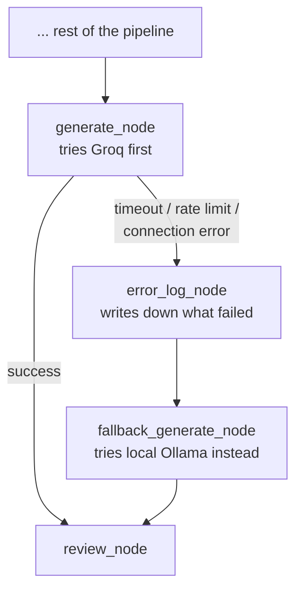

# Day 19. What Happens When the Main AI Service Goes Down?

## What problem was I solving today?

Every day so far assumed Groq (the service running your main AI model) would always answer, always work, always be reachable. Real cloud services don't actually make that promise, they can time out, hit rate limits (you already met this personally, back on Day 3), or simply go down for a few minutes. Day 19 built a genuine safety net for that exact situation: if Groq fails for any reason, the system automatically switches to a *second*, smaller AI model, one running entirely on your own computer, called Ollama. so the conversation can keep going instead of crashing.

## What did I actually type, and what does it mean?

**Cell. A small model running locally, on your own machine**
```python
OLLAMA_MODEL = "llama3.2:1b"

def call_ollama(messages: list, system: str = "") -> str:
    response = requests.post(
        f"{OLLAMA_BASE_URL}/api/chat",
        json={"model": OLLAMA_MODEL, "messages": full_messages, "stream": False, ...},
        timeout=120
    )
    return response.json()["message"]["content"]
```
Ollama is a program you install that lets you run AI models directly on your own computer, with no internet connection or cloud service required once the model is downloaded. `llama3.2:1b` specifically refers to a genuinely small model "1b" means roughly 1 billion parameters, tiny compared to the 70-billion-parameter model you've been using through Groq. This is a deliberate, sensible trade-off: a small model is much less capable, but it runs on ordinary hardware, doesn't need the internet, and is available specifically for the rare moments when it's needed as a fallback rather than a daily driver.

**Cell. Catching the *specific kind* of failure, not just "something went wrong"**
```python
try:
    answer = tracked_llm_call(messages=messages, system= GENERATOR_SYSTEM_PROMPT)
    return {"answer": answer, "api_error": False, ...}
except APITimeoutError as e:
    return {"answer": None, "api_error": True, "api_error_type": "timeout"}
except RateLimitError as e:
    return {"answer": None, "api_error": True, "api_error_type": "rate_limit"}
except APIConnectionError as e:
    return {"answer": None, "api_error": True, "api_error_type": "connection_error"}
```
This isn't just one generic `except Exception` catching everything the same way. it's catching three distinct, named categories of problem separately: a **timeout** (Groq took too long to respond), a **rate limit** (you've sent too many requests too quickly. exactly what happened to me on Day 3), and a **connection error** (Groq couldn't be reached at all). Recording exactly *which kind* of failure happened, rather than just "an error occurred," is genuinely useful later — it lets you look back and see whether your system mostly struggles with rate limits versus outright outages, which point to very different fixes.

**Cell. Two new boxes: log the failure, then switch models**
```python
def error_log_node(state: RAGState) -> dict:
    error_entry = {"timestamp": ..., "failed_node": "generate_node", "error_type": state.get("api_error_type"), ...}
    return {"error_log": existing_log + [error_entry]}

def fallback_generate_node(state: RAGState) -> dict:
    if not check_ollama_available():
        return {"answer": "The primary AI service is currently unavailable...", "using_fallback_llm": True}
    answer = call_ollama(messages=messages, system= GENERATOR_SYSTEM_PROMPT)
    return {"answer": answer, "using_fallback_llm": True, "api_error": False}
```
Two separate, honest jobs: `error_log_node` writes down that something went wrong before anything else happens, and `fallback_generate_node` actually tries the backup model. Notice `fallback_generate_node` even checks `check_ollama_available()` first because it's entirely possible your *local* Ollama installation could also be unreachable (maybe it isn't running), and the code is honest about that possibility too, returning a plain, apologetic message rather than crashing a second time.

**Cell. Rerouting after a failure, using the same conditional-edge pattern as always**
```python
def route_after_generate(state: RAGState) -> Literal["review_node", "error_log_node"]:
    if state.get("api_error"):
        return "error_log_node"
    return "review_node"
```
This is the exact same shape of decision you've now seen many times, read the state, return the name of the next box. What's new is what triggers it: not a quality judgment like Day 15's sufficiency check, but a genuine technical failure.

**Cell. Testing this honestly, by deliberately breaking things on purpose**
```python
def run_resilient_graph(question: str, force_error: str = None):
    if force_error:
        error_class = simulate_api_error(force_error)
        with patch.object(client.chat.completions, "create", side_effect= error_class(...)):
            final_state = resilient_graph.invoke(initial_state, config= config)
```
`patch.object(...)` is a testing technique that temporarily replaces a real piece of code. here, the actual Groq API call, with a fake version that deliberately throws the chosen error, for the duration of just this one test. This lets you *prove* your fallback logic actually works, on demand, without needing to wait around for a real outage to happen naturally.

## What actually happened when I ran it

A clean run with no simulated failure completed normally through Groq, with `using_fallback_llm` correctly staying `False` the whole way through. proof the new error-handling machinery doesn't interfere at all when nothing has actually gone wrong. The evaluation cell then moved on to Scenarios 2 and 3, deliberately forcing a timeout and then a rate-limit error, to confirm the Ollama fallback and the error log both engaged correctly when Groq genuinely failed, following through on exactly the safety net this whole day was built to prove works.

## The flow of Day 19



## Why this mattered for later days

The habit built today never let one single point of failure take down the whole conversation, is exactly the same spirit as Day 6's tool-hallucination validator, just applied one level up, to the AI service itself rather than to a single tool call. You'll meet this idea again implicitly through Week 4, where losing a connection to Redis or MongoDB (my memory storage) needs exactly this same kind of graceful, honest handling rather than a hard crash.
