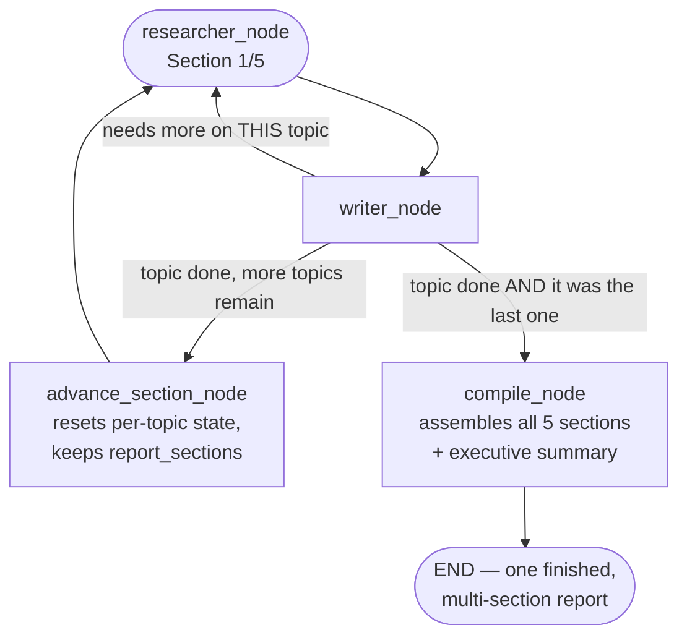

# Day 20 — The Week 3 Capstone: One Big Sprint, Everything Combined

## What problem was I solving today?

Day 20 is Week 3's version of Day 7 — a day with almost no brand-new ideas, and instead one genuinely big proof that everything built across the week actually works together. You took Day 18's Researcher-and-Writer pair and stretched it across **five separate topics in a row**, automatically, with the error-resilience from Day 19 wrapped around the whole thing, and Day 16's checkpointing saving progress the entire way through — producing one real, multi-section report about Apple's FY2024 10-K, written entirely by your own system, section by section.

## What did I actually type, and what does it mean?

**Cell — A new shared clipboard, built specifically for a multi-section job**
```python
class DocSummariserState(TypedDict):
    sections: list[str]
    section_index: int
    research_packets: list[dict]
    researcher_attempts: int
    report_sections: list[str]
    error_log: list[dict]
    using_fallback_llm: bool
    final_report: Optional[str]
```
`section_index` is the new, central idea today — a simple counter tracking *which* of the five topics the system is currently working on. Everything else here should look familiar: `research_packets`, `report_sections`, and `error_log` are the same shapes of data you built on Days 18 and 19, just now living inside a state designed to move through several topics rather than just one.

**Cell — Advancing to the next topic, and resetting what needs resetting**
```python
def advance_section_node(state: DocSummariserState) -> dict:
    next_index = state["section_index"] + 1
    next_topic = state["sections"][next_index] if next_index < len(state["sections"]) else None
    return {
        "section_index": next_index,
        "current_topic": next_topic if next_topic else state["current_topic"],
        "research_packets": [],
        "researcher_attempts": 0,
        "writer_attempts": 0,
    }
```
Look closely at what gets reset to empty here versus what doesn't: `research_packets` and the attempt counters are wiped clean, because they belong to whichever *single* topic just finished — you don't want section 3's evidence accidentally bleeding into section 4's report. But `report_sections` (the finished, written sections) is *not* reset here, because those need to keep accumulating across all five topics, ready for the final compile step at the very end.

**Cell — A three-way routing decision, not just two**
```python
def route_after_writer(state) -> Literal["researcher_node", "advance_section_node", "compile_node"]:
    if needs_more and attempts < max_attempts and state.get("follow_up_query"):
        return "researcher_node"
    is_last_section = state["section_index"] >= len(state["sections"]) - 1
    if is_last_section:
        return "compile_node"
    return "advance_section_node"
```
Compare this to Day 18's version, which only had two possible destinations. This one has three, because there are genuinely three different situations to handle: the Writer wants more evidence on the *current* topic (loop back to the Researcher), the current topic is finished but there are still more topics left (advance to the next one), or the current topic is finished *and* it was the last one (move on to compiling the whole document).

**Cell — The five real topics chosen for this run**
```python
sections = [
    "Apple's business overview and primary product/service segments in FY2024",
    "Key risk factors disclosed by Apple in the FY2024 10-K",
    "Apple's financial performance in FY2024 including net sales, net income, and gross margin",
    "Apple's liquidity, capital resources, and cash position at the end of FY2024",
    "Apple's approach to research and development investment in FY2024",
]
```
These five topics were deliberately chosen to span very different parts of a real 10-K filing — a business overview, qualitative risks, hard financial numbers, balance-sheet liquidity, and R&D strategy — specifically so the sprint would genuinely test the system's ability to research and write about meaningfully different *kinds* of content, not just five variations of the same question.

## What actually happened when I ran it

This is genuinely worth reading closely, because the real trace shows the system behaving thoughtfully rather than just mechanically. On Section 2 (risk factors), the Researcher's first pass reported only **PARTIAL** coverage — its own honest note read: *"Only three of the many risk factors listed in Item 1A are summarized; the full section contains additional material risks not captured here."* The Writer agreed more was needed, and the loop correctly sent the Researcher back for a second, more targeted attempt.

Section 3 (financial performance) is an even better example of honest, careful behavior. The first research pass found net sales and gross margin, but explicitly noted *"the net income figure is missing from the supplied context."* A second, more specific search was triggered — and even then, the Researcher's own coverage note stayed carefully qualified: *"net income and gross-margin figures are not present in the supplied excerpts and are based on external 10-K data, reducing confidence."* This is a genuinely good sign about how the system handles uncertainty: rather than confidently stating a number it wasn't sure about, it kept flagging exactly which parts of its own answer it was less certain of.

Sections 4 and 5 (liquidity and R&D investment) both reached **COMPLETE** coverage on the very first attempt, needing no loop-back at all — proof that when the retrieved evidence genuinely was sufficient, the system correctly recognized that too, instead of looping needlessly out of excessive caution.

## The flow of Day 20



## Why this mattered for later days

Just like Day 7 closed out Week 1 by proving a whole week of separate lessons genuinely compose into one working system, Day 20 does the same job for Week 3 at a larger scale — cycles (Day 15), checkpointing (Day 16), human approval patterns (Day 17), multi-agent collaboration (Day 18), and error resilience (Day 19) all had to work correctly, together, at the same time, across five separate topics, for this sprint to succeed. It's the clearest possible proof that LangGraph's map-based approach genuinely scales up cleanly, rather than becoming tangled the more capability you add to it.
