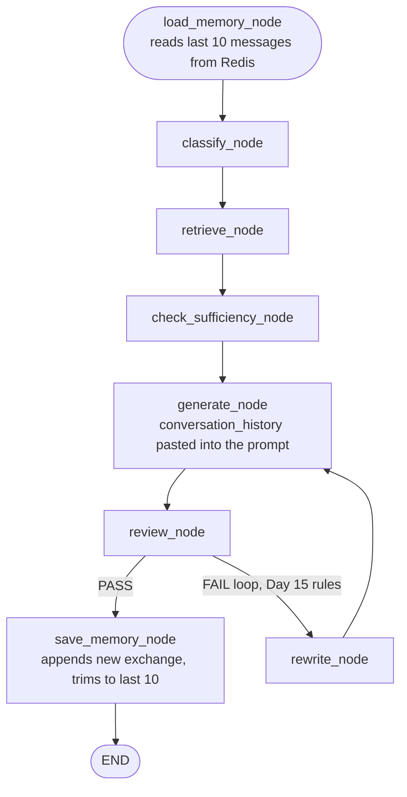

# Day 21 — Remembering What Was Just Said

## What problem was I solving today?

Every conversation you've had with your system up to this point has had total amnesia — you could ask "What was Apple's net income?" and get a perfect answer, but if you followed up with "How does that compare to last year?", the word "that" meant absolutely nothing to the system, because it had no memory the first question ever happened. Day 21 fixed the simplest, most common version of this problem: remembering the last few messages of a conversation, stored in a fast, separate database called Redis, so the model can actually resolve a word like "that" back to what you were just discussing.

## What did I actually type, and what does it mean?

**Cell — Connecting to Redis, and being honest about what happens if it's not there**
```python
WINDOW_SIZE = 10  # keeps the last 10 messages = 5 user/assistant exchanges

redis_client = redis.Redis(host= REDIS_HOST, port= REDIS_PORT, db= 0, decode_responses= True)

def check_redis_available() -> bool:
    try:
        redis_client.ping()
        return True
    except redis.exceptions.ConnectionError:
        print(f"❌ Redis not reachable at {REDIS_HOST}:{REDIS_PORT}")
        return False
```
Redis is a separate, extremely fast little database designed specifically for exactly this kind of job — storing and retrieving short lists of recent things quickly. `.ping()` is a simple, standard way to check "is this database actually running and reachable right now?" before trying to use it for real. Wrapping it in a `try/except` and returning a plain `True`/`False` means the rest of the system can ask this question safely, any time, without ever risking a crash if Redis happens to be down.

**Cell — Loading memory, right at the very start of every turn**
```python
def load_memory_node(state: RAGState) -> dict:
    key = f"conversation:{session_id}"
    if not check_redis_available():
        return {"conversation_history": []}
    raw_messages = redis_client.lrange(key, -WINDOW_SIZE, -1)
    history = [json.loads(m) for m in raw_messages]
    return {"conversation_history": history}
```
`lrange(key, -WINDOW_SIZE, -1)` asks Redis for "the last 10 items in this list" — Redis lets you count backward from the end using negative numbers, so `-10` means "10 items from the end" and `-1` means "the very last item." Each message was stored as a JSON string (a common, simple format for saving structured data as plain text), so `json.loads(m)` converts each one back into a real Python dictionary you can actually work with.

**Cell — Saving memory, and the one line that makes it a "window" instead of a never-ending log**
```python
def save_memory_node(state: RAGState) -> dict:
    key = f"conversation:{session_id}"
    user_msg = json.dumps({"role": "user", "content": state["question"]})
    assistant_msg = json.dumps({"role": "assistant", "content": state["answer"]})
    redis_client.rpush(key, user_msg, assistant_msg)
    redis_client.ltrim(key, -WINDOW_SIZE, -1)
```
`rpush` adds the new question and answer onto the *end* of the list. `ltrim(key, -WINDOW_SIZE, -1)` is the genuinely important line — it tells Redis "keep only the last 10 items, and permanently throw everything else away." Without this line, the list would just keep growing forever, holding every single message from every conversation ever had — this one line is what turns it into a rolling, bounded "sliding window" instead.

**Cell — Actually using the memory inside the answer-writing prompt**
```python
history_block = ""
history = state.get("conversation_history", [])
if history:
    lines = [f"{'User' if msg['role']=='user' else 'Assistant'}: {msg['content']}" for msg in history]
    history_block = "\n\nRecent conversation history...\n" + "\n".join(lines)
```
Simply *having* the history loaded onto the shared clipboard isn't enough by itself — `generate_node` had to be taught to actually paste it into the prompt it sends to the AI model. This block turns the raw stored messages back into readable, labelled conversation text right at the top of the prompt, so the model can genuinely see what "User" and "Assistant" said recently before it tries to answer a follow-up question.

## What actually happened when I ran it

The very first real test asked "What was Apple's net income for fiscal year 2024?" and got a clean, correct answer — $93,736 million — saved to Redis, bringing the window to 2 messages. The follow-up question, "How does that compare to fiscal year 2023?", correctly triggered `load_memory_node` to report **"Loaded 2 message(s) from Redis window"** — solid proof the memory genuinely carried over between two separate calls.

It's worth being honest about what happened next, because it's a real and useful result: the Reviewer actually **rejected** the follow-up answer three times in a row. Its repeated verdict was blunt: *"The answer claims insufficient information despite the context providing fiscal 2023 data, and it does not address the comparison question."* After the maximum of two rewrites was reached, the system correctly gave up gracefully rather than looping forever, returning its best attempt with a warning. This is worth sitting with honestly rather than treating as a clean success — the *memory* worked exactly as designed (the system definitely knew "that" meant net income, because the follow-up question was correctly classified as `COMPLEX`, needing a comparison), but the *generation* step still struggled to actually weave the remembered context and the newly retrieved 2023 figures together into one satisfying answer. This is a genuinely realistic outcome, and precisely the kind of gap Day 23's summary tier and the recall test on Day 25 exist to measure more rigorously.

## The flow of Day 21



## Why this mattered for later days

This is the simplest, cheapest possible kind of memory — it remembers *everything*, verbatim, but only for the last 10 messages, and it forgets completely the moment a new session starts. Both of those limitations are deliberate, and both get addressed head-on in the very next few days: Day 22 builds memory that survives *between* sessions, and Day 23 builds a way to keep the *gist* of older messages even after they've scrolled out of this window.
