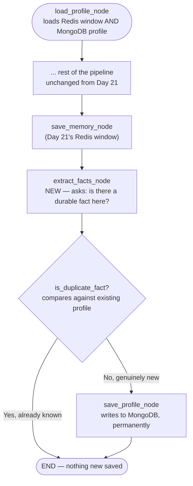

# Day 22. Remembering *Who You Are*, Not Just What Was Said

## What problem was I solving today?

Day 21's memory is genuinely useful, but it has a real limitation: the moment you start a brand new session, it's completely gone, as if you'd never spoken to the system before. But some things a person tells you shouldn't be tied to just one conversation. if you mention "I'm a CFA charterholder, so use standard financial terms," that's true forever, not just for the next 10 messages. Day 22 built a second, separate kind of memory: a permanent profile, stored in MongoDB, that survives across every future session, no matter how much time passes in between.

## What did I actually type, and what does it mean?

**Cell. A dedicated MongoDB collection just for durable facts about people**
```python
profiles_collection = profile_db["user_profiles"]
profiles_collection.create_index("user_id")
```
This creates a proper index on `user_id` think of an index like the tabs in a phone book that let you jump straight to "S" instead of reading every single name from the beginning. Without it, MongoDB would technically still work, just slower, because it would have to scan through every stored profile to find the right one every time.

**Cell. Loading BOTH memory tiers together, not just one**
```python
def load_profile_node(state: RAGState) -> dict:
    history = []
    if check_redis_available():
        raw_messages = redis_client.lrange(key, -WINDOW_SIZE, -1)
        history = [json.loads(m) for m in raw_messages]

    profile_doc = profiles_collection.find_one({"user_id": user_id})
    facts = profile_doc.get("facts", []) if profile_doc else []
    return {"conversation_history": history, "user_profile_facts": facts}
```
This box now checks two entirely separate storage systems in one go. the short-term Redis window from yesterday, *and* the long-term MongoDB profile. `find_one({"user_id": user_id})` looks up a document by the person's ID. and if that person has genuinely never been seen before, `profile_doc` will simply be `None`, which is exactly why the code carefully checks `if profile_doc else []` rather than assuming a result will always exist.

**Cell. The Fact Extractor, and a real bug worth understanding fully**
```python
FACT_EXTRACTOR_SYSTEM_PROMPT = """...
Respond in EXACTLY this format:
HAS_FACT: <YES or NO>
FACT: <the fact stated in third person...>
"""

def extract_facts_node(state: RAGState) -> dict:
    raw = tracked_llm_call(...)
    has_fact_match = re.search(r"HAS_FACT:\s*(YES|NO)", raw)
    fact_match = re.search(r"FACT:\s*(.+)", raw)
```
Here's a genuinely important, real bug to understand slowly, because it's a fantastic lesson about how regular expressions actually work. Look at the AI's expected response format: it always starts with the line `HAS_FACT: YES` (or `NO`). Now look at the second pattern: `re.search(r"FACT:\s*(.+)", raw)`. This is meant to find the *separate* `FACT:` line further down. But `re.search` doesn't know or care about *lines* it just scans through the entire block of text looking for the very first place the letters `F-A-C-T-:` appear anywhere at all. And the word `"HAS_FACT:"` itself **contains** the exact substring `"FACT:"` inside it! So this pattern actually matches *inside* the word `HAS_FACT:` on the very first line, and captures whatever comes right after it. which is the word `"YES"`.

The real output confirms this exactly:
```
→ Fact detected: YES
```
Instead of capturing something like "The user is a financial analyst," the system captured the literal word "YES" and saved *that* as if it were a real, meaningful fact about the user. This is a wonderful, honest example of a subtle regex trap: two patterns that look completely unrelated to a human reader (`HAS_FACT:` and `FACT:`) can genuinely overlap from a computer's point of view, because a computer doesn't see "two different words" it sees "an unbroken string of letters," and `FACT:` happens to be hiding inside `HAS_FACT:`. A fix would be something like anchoring the search to the start of a line (`re.search(r"^FACT:\s*(.+)", raw, re.MULTILINE)`), or simply checking for `FACT:` only in whatever text comes *after* the `HAS_FACT:` line has already been found and removed.

**Cell. Deduplication: checking a new fact against what's already known**
```python
def is_duplicate_fact(new_fact: str, existing_facts: list[dict]) -> bool:
    ...
    raw = tracked_llm_call(messages=[...], system= DEDUP_SYSTEM_PROMPT)
    return (verdict_match.group(1) if verdict_match else "NO") == "YES"
```
Before saving anything new, the system asks a separate AI call to compare the new fact against everything already stored for this person, checking if it's just the same idea worded differently. This matters because without it, saying "I'm a CFA charterholder" once and "I hold a CFA" a week later would create two separate, redundant entries instead of being recognized as the same thing.

## What actually happened when I ran it

The real, honest result is exactly what the bug above predicts: across the evaluation, the profile that got saved to MongoDB contained the literal fact **"YES"** — not a meaningful sentence about the user, but the leftover fragment of a mis-matched regex. This is genuinely valuable to see, because it demonstrates something important about testing: everything *around* the bug worked completely correctly. the MongoDB connection, the `upsert` logic, the deduplication check, the loading on a later session. the actual storage and retrieval mechanics performed exactly as designed. The one thing that went wrong was extracting the *right piece of text* to store, which is precisely the kind of narrow, fixable bug that's easy to find once you know to look at the literal saved data rather than assuming the pipeline worked just because it didn't crash.

## The flow of Day 22



## Why this mattered for later days

Beyond the specific bug, today's real lesson is this: **the same regex trap. one label's text accidentally hiding inside a longer label's text  is exactly the kind of thing worth double-checking any time you parse AI output with patterns that share overlapping words.** This same "YES" bug quietly carries forward into Day 23 and Day 24's evaluations too, since they reuse this exact function unchanged. a good, honest reminder that a bug found on one day doesn't automatically get fixed just because later days build on top of it; it has to be deliberately noticed and corrected.
