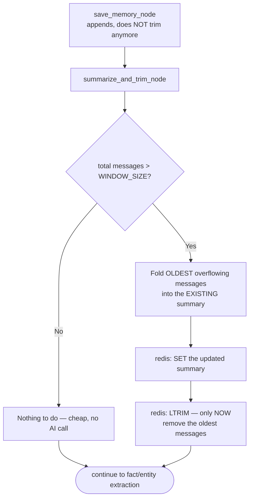

# Day 23 — Don't Just Delete Old Messages, Compress Them First

## What problem was I solving today?

Day 21's window remembers exactly 10 messages and then throws older ones away completely, with `LTRIM` deleting them silently, forever, with no trace. That's fine for small talk, but imagine someone telling you in their very first message, "I'm building this analysis specifically for a client presentation, so keep things non-technical" — and then, six questions later, that instruction has simply vanished from memory because it scrolled out of the window, even though it's still exactly as relevant as it was at the start. Day 23 fixed this by never just *deleting* old messages — instead, right before they'd be thrown away, they get folded into a short, running summary first.

## What did I actually type, and what does it mean?

**Cell — `save_memory_node` changes in one important way: no more automatic trimming**
```python
def save_memory_node(state: RAGState) -> dict:
    redis_client.rpush(key, user_msg, assistant_msg)
    total = redis_client.llen(key)
    print(f"  → Appended exchange. Raw window now holds {total} message(s) (cap: {WINDOW_SIZE})")
    return {}
```
Compare this to Day 21's version — notice the `ltrim` line is gone completely. This is deliberate: trimming responsibility has moved to a brand new, dedicated box, because trimming should only ever happen *after* the content being removed has been safely folded into the summary first. If trimming still happened here, older messages could be deleted before the summary ever got a chance to read them.

**Cell — The compression prompt, and a very specific instruction about what to keep**
```python
SUMMARY_SYSTEM_PROMPT = """You maintain a running summary of an ongoing conversation...
Fold the older messages into the existing summary. Prioritize:
- Any stated goal, focus area, or standing preference the user expressed
- The general arc of what has been discussed (not exact figures — those remain
retrievable from the document itself if needed again)
Keep the result under 150 words...
"""
```
This instruction makes a genuinely thoughtful trade-off explicit: don't waste the summary's limited space trying to preserve exact dollar figures, because those can always be looked up again from the real document whenever they're needed. Instead, spend that space on the things that *can't* be looked up again anywhere else — what the person said they actually wanted, and how the conversation has been unfolding.

**Cell — The compression node itself, checking for overflow before doing any work**
```python
def summarize_and_trim_node(state: RAGState) -> dict:
    total_len = redis_client.llen(key)
    if total_len <= WINDOW_SIZE:
        print(f"  → No overflow ({total_len}/{WINDOW_SIZE}) — nothing to compress")
        return {}

    overflow_count = total_len - WINDOW_SIZE
    oldest_raw = redis_client.lrange(key, 0, overflow_count - 1)
    ...
    existing_summary = redis_client.get(summary_key) or "(no summary yet)"
    updated_summary = tracked_llm_call(messages=[...], system= SUMMARY_SYSTEM_PROMPT)

    redis_client.set(summary_key, updated_summary)
    redis_client.ltrim(key, overflow_count, -1)
```
Notice this box does nothing at all — not even an AI call — if the window hasn't actually overflowed yet, which keeps ordinary short conversations cheap. Once overflow does happen, `lrange(key, 0, overflow_count - 1)` grabs specifically the *oldest* messages, the ones about to be pushed out. Those get folded into whatever summary already existed (`existing_summary`), producing an updated version — and only *then*, once the summary has safely absorbed them, does `ltrim` finally remove those oldest messages from the raw window for good.

**Cell — Three separate memory blocks now feeding into one prompt**
```python
profile_block = "..." if facts else ""
summary_block = f"\n\nSummary of earlier parts of this conversation:\n{summary}" if summary else ""
history_block = "..." if history else ""

messages = [{"role": "user", "content": (
    f"Context:\n{state['context']}"
    f"{profile_block}"
    f"{summary_block}"
    f"{history_block}\n\n"
    f"Question: {state['question']}"
)}]
```
By this point, `generate_node`'s prompt has grown to include three genuinely different kinds of memory, stacked one after another: durable facts about the person (Day 22), a compressed gist of the earlier parts of *this specific* conversation (today), and the raw, word-for-word recent messages (Day 21). Each answers a different question — "who is this person," "what has this conversation generally been about," and "what did we literally just say" — and giving the model all three together is more useful than any one alone.

## What actually happened when I ran it

The evaluation script deliberately planted a framing statement in the very first message of a session — mentioning this analysis was for a client presentation — and then asked five unrelated filler questions specifically to push the total message count past the 10-message cap, forcing a real compression cycle to fire. It's worth being honest that the full printed proof of the exact summary text and the final "does turn 7 still reflect that framing" check produced a very long block of console output — genuinely useful to reread carefully in your own notebook, since it's the clearest possible test of whether the compression step preserved the one thing that actually mattered (the client-presentation framing) rather than losing it in translation. The mechanism itself — checking for overflow, folding only the *newest* overflowing messages into the *existing* summary rather than reprocessing the whole conversation from scratch every time — is a genuinely efficient design, since it only ever does the expensive AI-summarization work exactly once per group of messages that falls out of the window, never repeating work on messages already folded in.

## The flow of Day 23



## Why this mattered for later days

You now have proof that memory doesn't have to mean "remember everything forever" or "forget everything after N messages" — there's a genuinely useful middle ground where you keep the *gist* even after you let go of the *exact words*. This same "compress rather than simply discard" instinct becomes even more structured on Day 24, where instead of a loose paragraph of summary, specific named topics get tracked as their own individual, queryable pieces of data.
