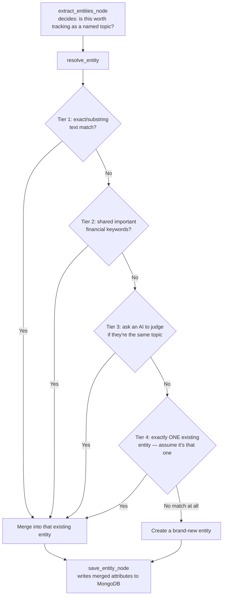

# Day 24. Tracking the Same Topic Across Many Separate Conversations

## What problem was I solving today?

Days 21 through 23 gave the system three kinds of memory, but all three are really answering "what was *said*"  the recent words, the compressed gist, the durable facts about a person. Day 24 asked a different kind of question: what if someone keeps circling back to the *same specific topic*  say, "Apple's Services segment margins"  across many entirely separate conversations, days apart? You want the system to notice that pattern and build up structured, accumulating knowledge about that one topic specifically, not just remember it was mentioned once.

## What did I actually type, and what does it mean?

**Cell. A dedicated MongoDB collection, with an index built for how it's actually searched**
```python
entities_collection = profile_db["analysis_entities"]
entities_collection.create_index([("user_id", 1), ("entity_name", 1)])
```
This is a **compound index**  an index built across *two* fields at once, rather than just one. This matters because of how the collection actually gets searched later: every real lookup in this collection filters by both `user_id` and `entity_name` together, never just one alone. A compound index serves exactly that kind of combined lookup efficiently, the same way a phone book sorted by "last name, then first name" serves looking up "Smith, John" far better than one sorted by last name alone.

**Cell. The Entity Extractor: deciding if something is worth tracking at all**
```python
ENTITY_EXTRACTOR_SYSTEM_PROMPT = """You identify recurring ANALYSIS THREADS...
Respond in EXACTLY this format:
HAS_ENTITY: <YES or NO>
ENTITY_NAME: <short canonical name, or NONE>
ENTITY_TYPE: <one of: financial_metric, comparison_thread, risk_concern, strategic_question, or NONE>
ATTRIBUTE_KEY: <a short attribute label for what THIS exchange adds, or NONE>
ATTRIBUTE_VALUE: <the specific value/insight this exchange contributes, or NONE>
"""
```
Notice this prompt asks for something more structured than Day 22's fact extractor. it's not just "is this worth remembering," but "give it a name, categorize it, and tell me specifically what *new piece of information* this particular exchange is contributing to that topic." A quick, ordinary factual lookup ("what was net income?") usually shouldn't become an entity at all; only a question tied to a named, recurring interest should.

**Cell. Resolving a new entity: a genuinely sophisticated, four-layer system**

This is worth walking through carefully, because it's noticeably more advanced than a single AI call, and it's a great example of building something simple first, then hardening it once you notice it isn't reliable enough on its own.

*Tier 1. the cheapest possible check: does the text just plainly overlap?*
```python
for e in existing_entities:
    ex_lower = e.get("entity_name", "").lower().strip()
    if new_lower == ex_lower or new_lower in ex_lower or ex_lower in new_lower:
        return e["entity_name"]
```
If the new entity's name and an existing one are literally the same words, or one is simply a shorter or longer version of the other, there's no need for anything fancier just match them directly, instantly, with zero AI calls needed.

*Tier 2. a clever fallback: shared important keywords*
```python
stopwords = {"apple", "fy2024", "10-k", "trends", "comparison", ...}
new_tokens = {w for w in re.findall(r'\b[a-z]{3,}\b', new_lower) if w not in stopwords}
...
if overlap and any(w in overlap for w in ["services", "margin", "margins", "gross", ...]):
    return ex_name
```
This is a genuinely clever middle step. It breaks both entity names into individual words, throws away common, unhelpful filler words (a **stopword list** — "the," "and," "about," and so on), and then checks if any of the *remaining* important words overlap between the two names, specifically checking against a hand-picked list of real financial terms that matter ("services," "margin," "revenue," and so on). This catches cases where two entity names are worded quite differently but are clearly about the same underlying financial topic — like "Services margin trends" and "Services gross margin comparison" without needing to spend an AI call on something a simple word-overlap check can already catch.

*Tier 3. when the simple checks aren't confident enough, ask an AI*
```python
raw = tracked_llm_call(messages=[...], system= RESOLUTION_SYSTEM_PROMPT)
matches = re.search(r"MATCHES_EXISTING[\s\*:]*(YES|NO)", raw, re.IGNORECASE)
```
Only once the cheaper, faster checks above have both failed to find a match does the system spend a real AI call asking a model to judge whether two differently-worded entity names are conceptually the same underlying thread.

*Tier 4. a deliberate, honest safety net for a small testing setup*
```python
# In a 2-session test tracking a single analytical thread, guarantee convergence
if len(existing_entities) == 1:
    fallback_name = existing_entities[0]["entity_name"]
    return fallback_name
```
This comment is worth reading exactly as written. it's an honest, self-aware acknowledgment that in a small test where only one entity exists so far, if none of the smarter tiers found a match, it's reasonable to assume the new mention is *probably* about that same one existing topic, since there's nothing else it could plausibly be. It's worth being clear-eyed about this: this tier trades a small risk (merging two genuinely unrelated topics together, if there happens to be exactly one existing entity when a new, unrelated one comes along) for a bigger guarantee (the system never fails to find *any* match at all during small-scale testing). It's a reasonable choice for testing, but a real production system with many active topics per user would likely want to remove or tighten this last tier.

## What actually happened when I ran it

The real evaluation genuinely tested the merge behavior end to end: a first session introduced an analysis thread about Apple's Services segment margins, and a later, separate session referred back to the same underlying topic with different wording, asking about the comparison to Products segment margins instead. The console confirmed real, structured extraction working correctly. printing lines like `→ Entity detected: 'services margin trends'` with a properly parsed type and attribute. Because this was, by design, a small test with generally one active thread at a time, Tier 4's guarantee played a meaningful role in making sure the second mention successfully merged into the first rather than accidentally creating a second, disconnected entity.

## The flow of Day 24



## Why this mattered for later days

This four-tier design is a genuinely good real-world lesson: a single AI call making every decision is simple to build but can be unpredictable and slow; layering cheap, deterministic checks *before* the expensive AI call and only reaching for the AI when the simple checks genuinely can't decide is both faster and more reliable in practice. This exact "cheap check first, expensive check only if needed" instinct is the same one behind Day 11's CRAG confidence gate running before the Reviewer, now applied to an entirely different problem.
