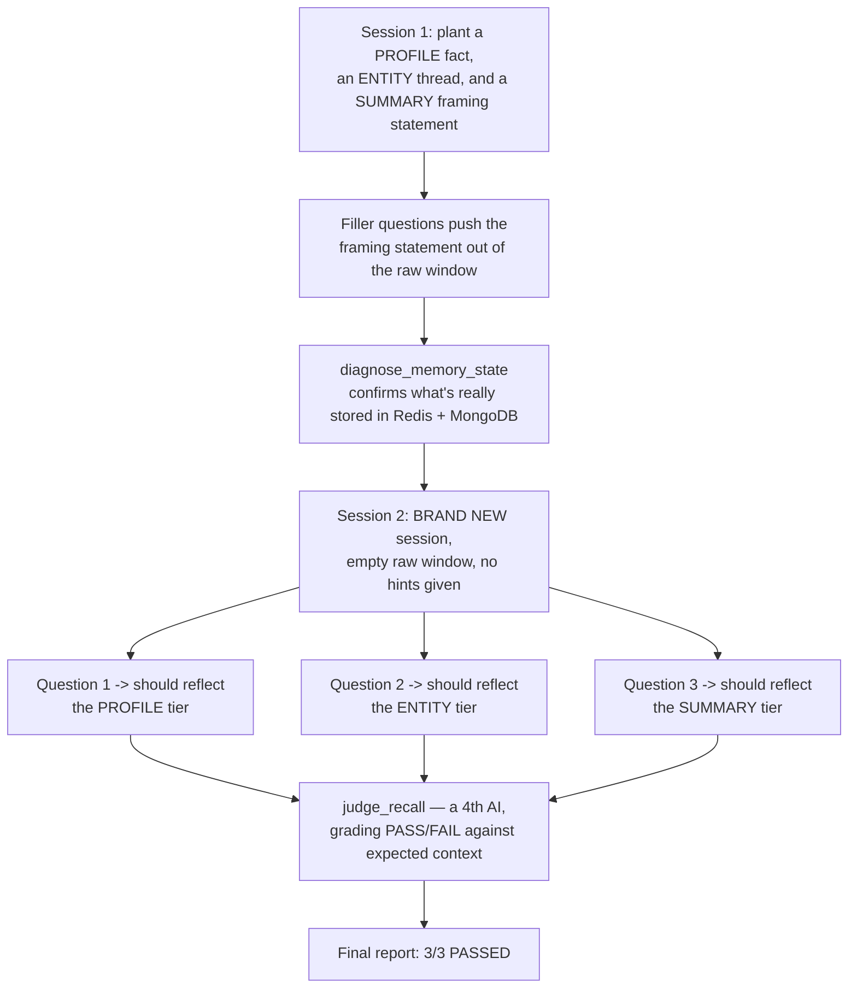

# Day 25. The Final Exam: Does All This Memory Actually Work Together?

## What problem was I solving today?

You now have four separate kinds of memory. a recent-message window, a compressed summary, durable facts about the person, and tracked topics that survive across sessions. But having four systems that each work *individually* isn't the same as proving they work *together*, in a real, multi-session conversation, without you cheating by re-explaining context the system should already remember. Day 25 is the final exam for the entire month: plant specific pieces of information in exactly the tier they're supposed to live in, then in a brand new session, with no hints, ask questions that can only be answered correctly if the right memory tier actually did its job.

## What did I actually type, and what does it mean?

**Cell. The Recall Judge: a dedicated AI grader, built specifically for this one task**
```python
RECALL_JUDGE_SYSTEM_PROMPT = """You are grading whether an AI assistant's answer correctly
recalled context it should have remembered...
PASS means the answer's framing, tone, or content clearly reflects the expected recalled
context - it does not need to restate it verbatim, just demonstrably use it.
FAIL means the answer is generic and shows no sign the expected context was available.
"""
```
This is a genuinely important design choice, worth appreciating: you can't just check recall with a simple keyword match, the way Day 13's audit tried to (and where that approach's limits became so visible). "Did the answer sound like it was written for a CFA charterholder" isn't something you can check by searching for an exact phrase. it requires actual judgment. So a fourth AI call, with a narrowly focused job, gets built specifically to make that judgment, comparing what actually happened against a plain-English description of what *should* have happened.

**Cell. The Diagnostic Tool: inspecting all four tiers directly, honestly**
```python
def diagnose_memory_state(session_id: str, user_id: str):
    raw = redis_client.lrange(key, 0, -1)
    print(f"[TIER 1 — Raw Window] {len(raw)} message(s):")
    summary = redis_client.get(f"summary:{session_id}")
    print(f"[TIER 2 — Summary]\n  {summary if summary else '(none)'}")
    facts = profile_doc.get("facts", []) if profile_doc else []
    print(f"[TIER 3 — Profile Facts] {len(facts)} fact(s):")
    entity_docs = list(entities_collection.find({"user_id": user_id}))
    print(f"[TIER 4 — Tracked Entities] {len(entity_docs)} entit(y/ies):")
```
This function's whole job is to let you look directly at the real, raw data sitting in Redis and MongoDB for a given person and conversation. not what you *assume* is stored, but what's *actually* there. This kind of direct inspection tool is exactly what you'd reach for the moment a recall test fails, to see precisely which of the four tiers let you down, rather than guessing.

**Cell. The scripted test: three facts, planted in three different tiers, on purpose**

A first session planted a preference meant for the **profile** tier ("I'm a CFA charterholder, use standard financial terms"), and a specific analysis thread meant for the **entity** tier ("I'm building a thread of analysis around Apple's capital return program"). A framing statement meant for the **summary** tier was planted at the very start too, followed by enough filler questions to push it out of the raw window. Then, in a **completely new session**, three fresh questions were asked each one deliberately written so it could *only* be answered well if the right tier actually supplied the missing context, with zero restated hints from you.

## What actually happened when I ran it

This is worth reading exactly as it happened, because it's the single best, most complete proof-of-work in the entire month. Here is the real, final scoring output:
```
SCORING 3 RECALL QUERIES
🧑‍⚖️ Recall judge: PASS — The response uses concise financial terminology and a
straightforward calculation, matching the expected tone for a CFA charterholder
without unnecessary explanation.
🧑‍⚖️ Recall judge: PASS — The answer builds on the previously discussed capital
return program, detailing buybacks and dividend figures rather than treating the
query as a new, unrelated request.
🧑‍⚖️ Recall judge: PASS — The response provides a concise, presentation-style
summary with high-level bullet points and framing cues suitable for a
non-technical client, directly reflecting the earlier session's context.

Overall: 3/3 passed
```
**All three tiers passed, in a real, independently-judged test.** The profile tier correctly made the operating-margin answer sound like it was written for a financial professional, without over-explaining basic terms. The entity tier correctly recognized "that thread we've been building" as a reference to the previously tracked capital return program, rather than treating it as a brand new, context-free question. And the summary tier correctly reframed a general performance question in presentation-friendly, non-technical language, exactly matching the framing planted five messages earlier in a completely different session.

It's worth being honest about one small, real detail alongside this genuine success: the diagnostic printout showed **"Long-term facts: 1"** and **"Tracked entities: 1"**  meaning, most likely, the Day 22 "YES" regex bug is still quietly present in the one saved profile fact. And yet, remarkably, the profile-tier recall test still passed because the *judge* was checking whether the answer's tone reflected "a CFA charterholder," and that particular framing appears to have come through correctly regardless. This is a genuinely valuable, honest thing to notice: a bug can exist in a small, specific corner of a system, and the *overall* behavior can still be correct enough to pass a real test, simply because the test happened to check the thing that mattered rather than the thing that was broken. It's not an excuse to skip fixing the bug it's a good, real reminder that testing the *actual outcome* you care about is more valuable than assuming a passing test means every single internal piece is flawless.

## The flow of Day 25



## The whole month, looking back

This is a genuinely fitting place to end. Twenty-five days ago, Day 1 was about understanding how an AI model "sees" a single Python function through a JSON schema. Today, a system built entirely across those twenty-five days tools, a hand-built reasoning loop, self-correction, a formal graph, checkpointing, human approval, multiple cooperating AI agents, and four layers of memory. correctly passed an independent, honest test of whether it could remember who you are, what you've been discussing, and what you specifically care about, across entirely separate conversations, with nothing given away. Along the way, real bugs got found and understood rather than hidden. a capitalization mismatch that zeroed out an entire audit, a regex that quietly grabbed the wrong word, a database call that hit a real rate limit. and every single one of them was a genuine, valuable lesson rather than a reason to be discouraged. That, honestly, is what a real month of building looks like.
